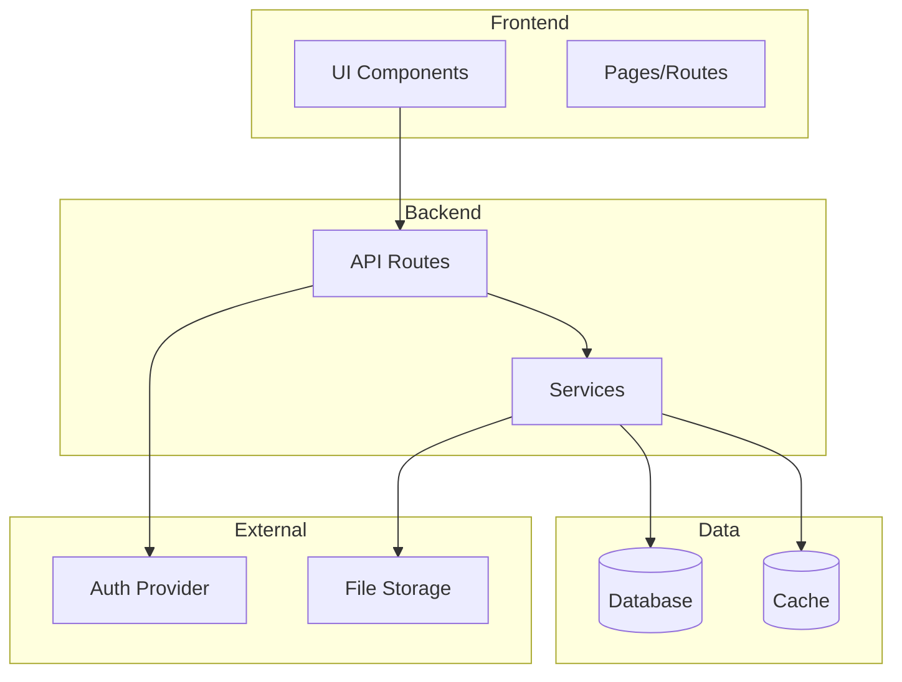

<!-- template:architecture -->
<!-- hydration:required -->

# Architecture

> Decisões arquiteturais e estrutura técnica do projeto.

---

## Architecture Diagram

<!-- placeholder:needs-hydration -->



<!-- /placeholder -->

---

## Directory Structure

<!-- placeholder:needs-hydration -->

```
/
├── src/
│   ├── app/                    # [DESCREVER]
│   ├── components/             # [DESCREVER]
│   ├── lib/                    # [DESCREVER]
│   └── ...
├── prisma/                     # [DESCREVER]
├── public/                     # [DESCREVER]
└── ...
```

<!-- /placeholder -->

---

## Key Decisions

<!-- placeholder:needs-hydration -->

### Decision 1: [TÍTULO]

**Context:** [Por que essa decisão foi necessária]

**Decision:** [O que foi decidido]

**Consequences:** [Impactos positivos e negativos]

---

### Decision 2: [TÍTULO]

**Context:** [Por que essa decisão foi necessária]

**Decision:** [O que foi decidido]

**Consequences:** [Impactos positivos e negativos]

<!-- /placeholder -->

---

## Patterns Used

<!-- placeholder:needs-hydration -->

| Pattern | Where Used | Purpose |
|---------|------------|---------|
| [PATTERN 1] | [LOCATION] | [PURPOSE] |
| [PATTERN 2] | [LOCATION] | [PURPOSE] |

<!-- /placeholder -->

---

## Integration Points

<!-- placeholder:needs-hydration -->

| Integration | Type | Purpose | Docs |
|-------------|------|---------|------|
| [SERVICE 1] | API | [PURPOSE] | [LINK] |
| [SERVICE 2] | Webhook | [PURPOSE] | [LINK] |

<!-- /placeholder -->

---

## Related Documents

- [📋 Project Overview](./project-overview.md) — Visão geral
- [📊 Data Flow](./data-flow.md) — Fluxo de dados
- [🔌 API Reference](./api-reference.md) — Endpoints
- [🔙 Docs Index](./README.md) — Índice de documentação
