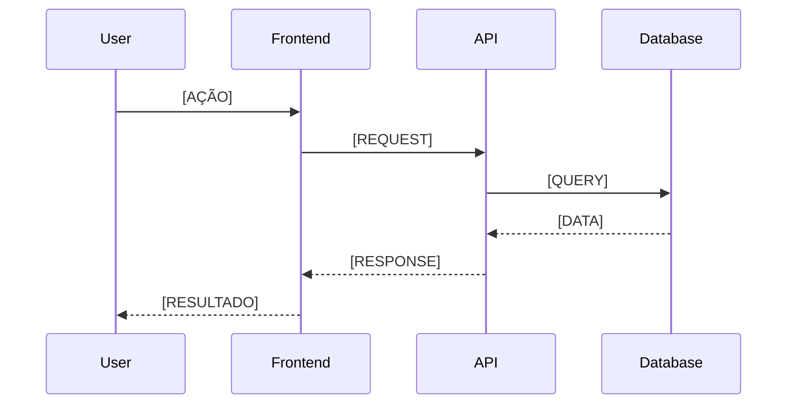

<!-- template:data-flow -->
<!-- hydration:required -->

# Data Flow

> Como os dados fluem através do sistema.

---

## Main Data Flows

<!-- placeholder:needs-hydration -->

### Flow 1: [NOME DO FLUXO]



**Description:** [DESCREVER O FLUXO]

---

### Flow 2: [NOME DO FLUXO]

```mermaid
sequenceDiagram
    [DIAGRAMA]
```

**Description:** [DESCREVER O FLUXO]

<!-- /placeholder -->

---

## Data Sources

<!-- placeholder:needs-hydration -->

| Source | Type | Data | Access Pattern |
|--------|------|------|----------------|
| [SOURCE 1] | Database | [WHAT DATA] | [HOW ACCESSED] |
| [SOURCE 2] | External API | [WHAT DATA] | [HOW ACCESSED] |

<!-- /placeholder -->

---

## Data Transformations

<!-- placeholder:needs-hydration -->

| Input | Transformation | Output | Where |
|-------|----------------|--------|-------|
| [INPUT] | [WHAT HAPPENS] | [OUTPUT] | [LOCATION] |

<!-- /placeholder -->

---

## Caching Strategy

<!-- placeholder:needs-hydration -->

| Data | Cache Location | TTL | Invalidation |
|------|----------------|-----|--------------|
| [DATA 1] | [WHERE] | [TIME] | [WHEN] |

<!-- /placeholder -->

---

## Related Documents

- [🏗️ Architecture](./architecture.md) — Estrutura técnica
- [🔌 API Reference](./api-reference.md) — Endpoints
- [🔙 Docs Index](./README.md) — Índice de documentação
