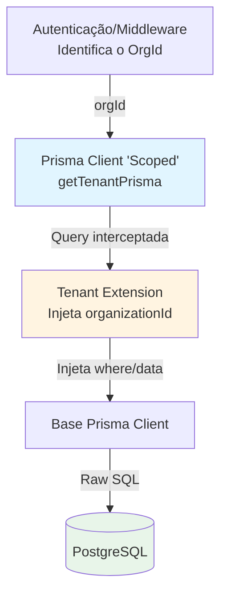

# Plano de Implementação: Infraestrutura de Isolamento de Tenant (Prisma Client Extensions)

Este plano descreve a implementação de uma camada de isolamento automático de dados para o multi-tenancy no **Prêmio Destaque**, utilizando **Prisma Client Extensions**. O objetivo é garantir que todas as operações de banco de dados sejam automaticamente filtradas pelo `organizationId` do tenant atual, eliminando riscos de vazamento de dados (tenant leak) e reduzindo o "boilerplate" nos Server Actions e API routes.

## Visão Geral

O sistema passará a utilizar um cliente Prisma "scoped" que injeta automaticamente filtros e valores padrão:
- **Filtro Automático**: Todas as operações de leitura (`findMany`, `findFirst`, `count`, etc.) incluirão o `organizationId` no `where`.
- **Injeção de Dados**: Operações de escrita (`create`, `createMany`, `upsert`) incluirão automaticamente o `organizationId` nos dados.
- **Proteção de Update/Delete**: Operações de mutação serão restritas ao escopo do tenant, impedindo alterações em registros de terceiros mesmo que o ID do registro seja conhecido.

## Referências

- [Prisma Client Extensions Documentation](https://www.prisma.io/docs/concepts/components/prisma-client/client-extensions)
- Codebase de referência: `spokes/carta-servicos/src/lib/prisma/tenant-extension.ts`
- Schema do projeto: `spokes/premio-destaque/prisma/schema.prisma`
- Guia de agents: [.context/agents/README.md](../agents/README.md)

## Arquitetura

## Pré-requisitos

1. **Identificação do Tenant**: O sistema deve ter uma forma consistente de obter o `organizationId` do contexto (já disponível via Auth/Middleware).
2. **Modelos Padronizados**: Os modelos principais já possuem o campo `organizationId` no schema.

## Passo 1: Implementação da Extensão

**Agent:** [agents/backend-development.md](../agents/backend-development.md)

### 1.1 Criar a Lógica da Extensão
Criar o arquivo `src/lib/prisma/tenant-extension.ts` seguindo o padrão de isolamento.
- Definir a lista de modelos que possuem `organizationId` diretamente (`Segmento`, `Estabelecimento`, `Lead`, `Tag`, `Enquete`, `Campanha`, `SpokeConfig`).
- Implementar interceptores para:
    - Queries de leitura: Adicionar `organizationId` ao objeto `where`.
    - Queries de escrita: Adicionar `organizationId` ao objeto `data`.
    - Validação de unicidade: Garantir que `findUnique` retorne `null` se o registro pertencer a outro tenant.

### 1.2 Factory de Clientes Scoped
Implementar as funções auxiliares:
- `getTenantPrismaClient(organizationId)`: Retorna uma instância estendida do Prisma.
- `withTenant(organizationId, callback)`: Executa uma lógica de negócio dentro de um escopo de tenant.
- Cache de instâncias: Implementar um `Map` para reutilizar instâncias estendidas por `organizationId` (evitando overhead de criação de instâncias repetitivas).

## Passo 2: Atualização do Singleton do Prisma

**Agent:** [agents/backend-development.md](../agents/backend-development.md)

### 2.1 Refatorar `src/lib/prisma.ts`
- Manter a exportação do `prisma` base (para tarefas de sistema/Global Admin).
- Exportar as novas funções `getTenantPrisma` e `withTenantScope`.
- Garantir compatibilidade com o ambiente de desenvolvimento (Singleton pattern).

## Passo 3: Refatoração Gradual dos Serviços

**Agent:** [agents/backend-development.md](../agents/backend-development.md)

### 3.1 Adaptar Server Actions
Identificar as principais Server Actions/API Routes e substituir o uso do `prisma` global pelo cliente scoped.
- Obter o `organizationId` do usuário autenticado.
- Instanciar o cliente via `getTenantPrisma(orgId)`.
- Remover filtros manuais de `organizationId` das chamadas.

## Passo 4: Testes de Segurança

**Agent:** [agents/qa-agent.md](../agents/qa-agent.md)

### 4.1 Testes de Cross-Tenant Access
**Cenário 1: Tentativa de leitura de outro tenant**
1. Autenticar como Usuário A (Org 1).
2. Tentar acessar um ID de Enquete pertencente à Org 2 via API.
3. **Resultado esperado**: O sistema deve retornar 404 ou Nulo, pois a extensão deve filtrar a query.

**Cenário 2: Escrita automática**
1. Criar um novo Lead via serviço scoped sem passar `organizationId`.
2. Verificar no banco de dados.
3. **Resultado esperado**: O campo `organizationId` deve estar preenchido corretamente com o ID do tenant ativo.

## Checklist de Implementação

### Setup de Infraestrutura
- [ ] Criar diretório `src/lib/prisma` se não existir.
- [ ] Criar arquivo `src/lib/prisma/tenant-extension.ts`.
- [ ] Implementar `createSpokeExtension` com suporte a `findMany`, `findFirst`, `create`, `update`, `delete`.
- [ ] Implementar cache de clientes por `organizationId`.
- [ ] Atualizar `src/lib/prisma.ts` para exportar `getTenantPrisma`.

### Modificações no Schema (Se necessário)
- [ ] Revisar se `Resposta` e `VotoEstabelecimento` precisam de `organizationId` direto para performance/isolamento extra (Opcional - Fase 2).

### Integração e Limpeza
- [ ] Refatorar `src/lib/campanhas/service.ts` para usar o cliente scoped.
- [ ] Refatorar `src/lib/enquetes/service.ts` para usar o cliente scoped.
- [ ] Remover clausulas `where: { organizationId }` redundantes nos arquivos refatorados.

### Qualidade e Validação
- [ ] Executar `npm run typecheck` para garantir que as extensões do Prisma preservam a tipagem.
- [ ] Validar isolamento com dois tenants diferentes em ambiente local.
- [ ] Verificar logs de query para confirmar se o filtro está sendo injetado.

## Notas Importantes
1. **Performance**: O uso de extensões tem um overhead mínimo, mas o cache de instâncias no `Map` é crucial para evitar memory leaks e lentidão.
2. **Exceções**: Tarefas que rodam em background (ex: cron jobs globais) ou dashboards de Super Admin ainda devem usar o cliente Prisma base.
3. **Tipagem**: Prisma Extensions podem ser complexas de tipar corretamente. Use o padrão `ReturnType<typeof createSpokeExtension>` se necessário.
