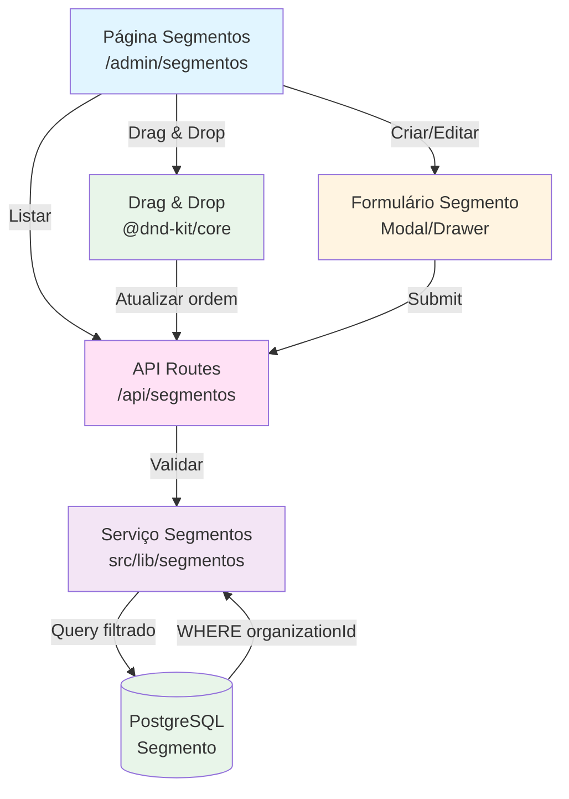

# Plano de Implementação: Gestão de Segmentos (Categorias)

Implementar sistema completo de gestão de segmentos hierárquicos com 2 níveis (pai e filho) para categorização de estabelecimentos. Os segmentos permitem organizar estabelecimentos em categorias como "Alimentação > Restaurantes" ou "Saúde > Clínicas", facilitando a criação de enquetes segmentadas e geração de rankings por categoria. Sistema inclui CRUD completo, drag-and-drop para reordenação, e personalização visual com cores e ícones.

## Visão Geral

O sistema permitirá:
- **Hierarquia de 2 Níveis**: Criar segmentos pai (ex: Alimentação) e filhos (ex: Restaurantes, Lanchonetes) para organização lógica
- **Personalização Visual**: Definir cor hexadecimal e ícone Lucide para cada segmento, facilitando identificação visual
- **Reordenação Drag-and-Drop**: Arrastar segmentos para alterar ordem de exibição em formulários e relatórios
- **Validação de Exclusão**: Impedir exclusão de segmentos com estabelecimentos vinculados para manter integridade referencial
- **Isolamento Multi-tenant**: Todos os segmentos filtrados por organizationId, garantindo separação entre tenants

## Referências

- [DnD Kit Documentation](https://docs.dndkit.com/) - Biblioteca para drag-and-drop
- [Lucide React Icons](https://lucide.dev/) - Biblioteca de ícones
- PRD Seção 4.1: [.context/inputs/PRD.md](../inputs/PRD.md#41-schema-prisma-completo) - Modelo Segmento
- [agents/database-development.md](../agents/database-development.md) - Padrões de schema
- [agents/frontend-development.md](../agents/frontend-development.md) - Padrões de UI
- [agents/backend-development.md](../agents/backend-development.md) - Padrões de API

## Arquitetura

**Notas sobre a arquitetura:**
- **Hierarquia Auto-referencial**: Modelo Segmento tem relação consigo mesmo via `paiId` para criar árvore de 2 níveis
- **Constraint Unique**: Slug único por organização para evitar duplicatas e permitir URLs amigáveis
- **Cascade Delete**: Ao excluir segmento pai, filhos são excluídos automaticamente (se não tiverem estabelecimentos)
- **Validação de Integridade**: Antes de excluir, verificar se existem estabelecimentos vinculados via EstabelecimentoSegmento

## Pré-requisitos

1. **RF-001 Implementado**: Autenticação OAuth2 funcional com organizationId no contexto
2. **Prisma Client Gerado**: Schema atualizado e `npx prisma generate` executado
3. **Ícones Lucide**: Biblioteca `lucide-react` instalada para seletor de ícones

## Passo 1: Configuração Inicial

**Agent:** [agents/frontend-development.md](../agents/frontend-development.md)

### 1.1 Instalar Dependências

**Dependências necessárias:**
- `@dnd-kit/core@6.1.0`: Core do DnD Kit para funcionalidade drag-and-drop
- `@dnd-kit/sortable@8.0.0`: Utilitários para listas ordenáveis
- `@dnd-kit/utilities@3.2.2`: Helpers para DnD Kit

### 1.2 Variáveis de Ambiente

Nenhuma variável de ambiente adicional necessária - usar configurações existentes.

## Passo 2: Schema do Banco de Dados

**Agent:** [agents/database-development.md](../agents/database-development.md)

### 2.1 Adicionar Modelo Segmento ao Prisma Schema

**Segmento**: Representa categorias hierárquicas para estabelecimentos

**Campos:**
- `id` (String @id @default(cuid())): Identificador único
- `organizationId` (String): ID da organização (multi-tenancy)
- `nome` (String): Nome do segmento (ex: "Restaurantes")
- `slug` (String): Slug para URLs (ex: "restaurantes")
- `paiId` (String?): ID do segmento pai (null para segmentos raiz)
- `cor` (String?): Cor hexadecimal (ex: "#FF5733") - opcional
- `icone` (String?): Nome do ícone Lucide (ex: "Utensils") - opcional
- `ordem` (Int @default(0)): Ordem de exibição

**Relações:**
- `pai` (Segmento?): Relação auto-referencial para segmento pai
- `filhos` (Segmento[]): Relação auto-referencial para segmentos filhos
- `estabelecimentos` (EstabelecimentoSegmento[]): Estabelecimentos vinculados via tabela pivot

**Índices:**
- `@@index([organizationId])`: Buscar segmentos por organização
- `@@unique([organizationId, slug])`: Garantir slug único por organização

**Constraints:**
- Slug único por organização para evitar conflitos
- Limite de 2 níveis de hierarquia (validar no backend)

**Padrões a seguir:**
- Usar `@default(cuid())` para IDs
- Sempre incluir `organizationId` para isolamento
- Usar `onDelete: Cascade` nas relações de estabelecimentos
- Validar hierarquia máxima de 2 níveis no backend

### 2.2 Executar Migração

Executar migração usando `npx prisma migrate dev --name add-segmento-model`.

**Referência:** [agents/database-development.md](../agents/database-development.md) - seção "Migration"

## Passo 3: Criar Serviços (Server-Side Logic)

**Agent:** [agents/backend-development.md](../agents/backend-development.md)

### 3.1 Serviço de Segmentos

Criar `src/lib/segmentos/segmento-service.ts` (server-only):

**Função: getSegmentos**
- Tipo: Função assíncrona que retorna Promise<Segmento[]>
- Parâmetros: `organizationId` (string)
- Retorno: Array de segmentos ordenados por `ordem`, incluindo relações pai e filhos

**Lógica a implementar:**
1. Buscar todos os segmentos da organização
2. Incluir relação `pai` e `filhos` para montar hierarquia
3. Ordenar por campo `ordem` ascendente
4. Retornar árvore completa de segmentos

**Função: createSegmento**
- Tipo: Função assíncrona que retorna Promise<Segmento>
- Parâmetros: `data` (objeto com nome, slug, paiId, cor, icone), `organizationId` (string)
- Retorno: Segmento criado

**Lógica a implementar:**
1. Validar que slug é único para a organização
2. Se `paiId` fornecido, validar que pai existe e não tem pai (máximo 2 níveis)
3. Gerar slug automaticamente a partir do nome se não fornecido
4. Criar segmento com `organizationId` e `ordem` baseada na contagem atual
5. Retornar segmento criado

**Função: updateSegmento**
- Tipo: Função assíncrona que retorna Promise<Segmento>
- Parâmetros: `id` (string), `data` (objeto com campos a atualizar), `organizationId` (string)
- Retorno: Segmento atualizado

**Lógica a implementar:**
1. Verificar que segmento existe e pertence à organização
2. Se alterando `paiId`, validar hierarquia de 2 níveis
3. Se alterando slug, validar unicidade
4. Atualizar campos fornecidos
5. Retornar segmento atualizado

**Função: deleteSegmento**
- Tipo: Função assíncrona que retorna Promise<void>
- Parâmetros: `id` (string), `organizationId` (string)
- Retorno: void

**Lógica a implementar:**
1. Verificar que segmento existe e pertence à organização
2. Contar estabelecimentos vinculados via EstabelecimentoSegmento
3. Se houver estabelecimentos, lançar erro impedindo exclusão
4. Excluir segmento (filhos serão excluídos por cascade se não tiverem estabelecimentos)

**Função: reorderSegmentos**
- Tipo: Função assíncrona que retorna Promise<void>
- Parâmetros: `updates` (array de {id, ordem}), `organizationId` (string)
- Retorno: void

**Lógica a implementar:**
1. Validar que todos os IDs pertencem à organização
2. Usar transação Prisma para atualizar ordem de múltiplos segmentos atomicamente
3. Atualizar campo `ordem` de cada segmento conforme array

**Tratamento de Erros:**
- Slug duplicado: Retornar erro 400 com mensagem clara
- Segmento não encontrado: Retornar erro 404
- Hierarquia inválida: Retornar erro 400 explicando limite de 2 níveis
- Estabelecimentos vinculados: Retornar erro 409 com contagem de estabelecimentos

**Padrões:**
- Sempre filtrar por `organizationId` em todas as queries
- Usar transações para operações que afetam múltiplos registros
- Validar integridade referencial antes de exclusões
- Retornar erros específicos com mensagens claras

**Referência:** [docs/backend.md](../docs/backend.md) - padrões de serviços

## Passo 4: API Routes

**Agent:** [agents/backend-development.md](../agents/backend-development.md)

### 4.1 Listar Segmentos - GET

Criar `src/app/api/segmentos/route.ts`:

**Endpoint:** `GET /api/segmentos`

**Autenticação:**
- Usar `getOrganizationId()` helper para obter organizationId do token
- Retornar 401 se não autenticado

**Query Parameters:**
- `includeCount` (boolean, opcional): Se true, incluir contagem de estabelecimentos por segmento

**Lógica:**
1. Extrair organizationId do contexto
2. Chamar `getSegmentos(organizationId)`
3. Se `includeCount=true`, fazer query adicional para contar estabelecimentos
4. Retornar array de segmentos com hierarquia

**Respostas:**
- `200 OK`: Array de segmentos com estrutura hierárquica
- `401 Unauthorized`: Se não autenticado

### 4.2 Criar Segmento - POST

**Endpoint:** `POST /api/segmentos`

**Autenticação:**
- Usar `getOrganizationId()` helper
- Retornar 401 se não autenticado

**Validação (Zod Schema):**
- Campos obrigatórios: `nome` (string, mínimo 1 caractere)
- Campos opcionais: `slug` (string, formato slug), `paiId` (string cuid), `cor` (string hex), `icone` (string)
- Usar `.strict()` para rejeitar campos desconhecidos

**Lógica:**
1. Validar body com Zod
2. Extrair organizationId
3. Chamar `createSegmento(data, organizationId)`
4. Retornar segmento criado

**Respostas:**
- `201 Created`: Segmento criado com sucesso
- `400 Bad Request`: Validação falhou ou slug duplicado
- `401 Unauthorized`: Não autenticado

### 4.3 Atualizar Segmento - PUT

Criar `src/app/api/segmentos/[id]/route.ts`:

**Endpoint:** `PUT /api/segmentos/[id]`

**Autenticação:**
- Usar `getOrganizationId()` helper
- Retornar 401 se não autenticado

**Validação (Zod Schema):**
- Todos os campos opcionais: `nome`, `slug`, `paiId`, `cor`, `icone`
- Usar `.strict()` e `.partial()` para permitir atualizações parciais

**Lógica:**
1. Validar body com Zod
2. Extrair organizationId e id dos params
3. Chamar `updateSegmento(id, data, organizationId)`
4. Retornar segmento atualizado

**Respostas:**
- `200 OK`: Segmento atualizado
- `400 Bad Request`: Validação falhou
- `404 Not Found`: Segmento não encontrado
- `401 Unauthorized`: Não autenticado

### 4.4 Excluir Segmento - DELETE

**Endpoint:** `DELETE /api/segmentos/[id]`

**Autenticação:**
- Usar `getOrganizationId()` helper
- Retornar 401 se não autenticado

**Lógica:**
1. Extrair organizationId e id dos params
2. Chamar `deleteSegmento(id, organizationId)`
3. Retornar sucesso

**Respostas:**
- `204 No Content`: Segmento excluído
- `404 Not Found`: Segmento não encontrado
- `409 Conflict`: Segmento tem estabelecimentos vinculados
- `401 Unauthorized`: Não autenticado

### 4.5 Reordenar Segmentos - PATCH

Criar `src/app/api/segmentos/reorder/route.ts`:

**Endpoint:** `PATCH /api/segmentos/reorder`

**Autenticação:**
- Usar `getOrganizationId()` helper
- Retornar 401 se não autenticado

**Validação (Zod Schema):**
- Campo obrigatório: `updates` (array de objetos {id: string, ordem: number})
- Validar que array não está vazio

**Lógica:**
1. Validar body com Zod
2. Extrair organizationId
3. Chamar `reorderSegmentos(updates, organizationId)`
4. Retornar sucesso

**Respostas:**
- `200 OK`: Ordem atualizada
- `400 Bad Request`: Validação falhou
- `401 Unauthorized`: Não autenticado

**Padrões:**
- Seguir estrutura de API routes conforme [docs/backend.md](../docs/backend.md)
- Validar inputs com Zod usando `.strict()`
- Sempre filtrar por organizationId
- Retornar códigos HTTP apropriados

**Referência:** [agents/backend-development.md](../agents/backend-development.md) - padrões de API

## Passo 5: Interface Frontend

**Agent:** [agents/frontend-development.md](../agents/frontend-development.md)

### 5.1 Página de Segmentos

Criar `src/app/(admin)/admin/segmentos/page.tsx`:

**Rota:** `/admin/segmentos`

**Page Metadata:**
- Título: "Segmentos - Prêmio Destaque"
- Descrição: "Gerencie categorias de estabelecimentos"
- Breadcrumbs: "Home > Admin > Segmentos"

**Implementação:**
- Client Component ('use client')
- Usar hook `useSegmentos()` para buscar dados
- Exibir lista hierárquica de segmentos (pai > filhos indentados)
- Botão "Novo Segmento" no topo
- Ações por segmento: Editar, Excluir

**Data Fetching:**
- Hook: `useSegmentos()` em `src/hooks/use-segmentos.ts`
- Query key: `['segmentos', organizationId]`
- API endpoint: `GET /api/segmentos`

**UI Components:**
- Card para cada segmento pai com filhos indentados
- Badge com cor do segmento
- Ícone Lucide renderizado
- Botões de ação (Edit, Delete) com confirmação
- Empty state quando não há segmentos

**Drag and Drop:**
- Usar `DndContext` do @dnd-kit/core
- Usar `SortableContext` para lista ordenável
- Ao soltar, chamar mutation `useReorderSegmentos()`
- Feedback visual durante drag (opacidade, sombra)

**Padrões:**
- Seguir padrões de acessibilidade (labels, focus states)
- Usar Tailwind para estilização
- Confirmar exclusão com modal
- Exibir loading states durante operações

**Referência:** [agents/frontend-development.md](../agents/frontend-development.md) - padrões de páginas

### 5.2 Modal de Criar/Editar Segmento

Criar `src/components/admin/segmento-form-modal.tsx`:

**Props:**
- `isOpen` (boolean): Controla visibilidade
- `onClose` (função): Callback ao fechar
- `segmento` (Segmento?, opcional): Se fornecido, modo edição
- `segmentos` (Segmento[]): Lista para seletor de pai

**Formulário:**
- Campo: Nome (text, obrigatório)
- Campo: Segmento Pai (select, opcional, apenas segmentos raiz)
- Campo: Cor (color picker, opcional)
- Campo: Ícone (seletor de ícones Lucide, opcional)
- Botões: Cancelar, Salvar

**Validação:**
- Schema Zod alinhado com API
- Validação em tempo real
- Mensagens de erro claras

**Lógica:**
- Se modo edição, preencher campos com dados existentes
- Ao salvar, chamar `useCreateSegmento()` ou `useUpdateSegmento()`
- Fechar modal após sucesso
- Exibir toast de sucesso/erro

**Padrões:**
- Usar react-hook-form com Zod
- Componentes shadcn/ui (Dialog, Input, Select)
- Acessibilidade (labels, aria-labels)

### 5.3 Criar Hooks Customizados

Criar `src/hooks/use-segmentos.ts`:

**useSegmentos**: Hook para buscar segmentos
- Tipo: hook de query usando TanStack Query
- Query key: `['segmentos', organizationId]`
- API endpoint: `GET /api/segmentos`
- Configuração: staleTime 5 minutos (dados relativamente estáveis)

**useCreateSegmento**: Hook para criar segmento
- Tipo: hook de mutation usando TanStack Query
- API endpoint: `POST /api/segmentos`
- Dados esperados: {nome, slug?, paiId?, cor?, icone?}
- Cache invalidation: invalidar `['segmentos']` no onSuccess

**useUpdateSegmento**: Hook para atualizar segmento
- Tipo: hook de mutation usando TanStack Query
- API endpoint: `PUT /api/segmentos/[id]`
- Dados esperados: {id, ...campos a atualizar}
- Cache invalidation: invalidar `['segmentos']` no onSuccess

**useDeleteSegmento**: Hook para deletar segmento
- Tipo: hook de mutation usando TanStack Query
- API endpoint: `DELETE /api/segmentos/[id]`
- Cache invalidation: invalidar `['segmentos']` no onSuccess
- Tratamento de erro 409 (estabelecimentos vinculados)

**useReorderSegmentos**: Hook para reordenar segmentos
- Tipo: hook de mutation usando TanStack Query
- API endpoint: `PATCH /api/segmentos/reorder`
- Dados esperados: {updates: [{id, ordem}]}
- Cache invalidation: invalidar `['segmentos']` no onSuccess
- Optimistic update para feedback imediato

**Referência:** [agents/frontend-development.md](../agents/frontend-development.md) - TanStack Query

### 5.4 Navegação

Atualizar `src/components/admin/sidebar.tsx`:
- Adicionar item "Segmentos" no array de navegação
- URL: `/admin/segmentos`
- Ícone: `FolderTree` de `lucide-react`
- Posição: Antes de "Estabelecimentos"

## Passo 6: Validação de Limites (Spoke Subscription)

**Agent:** [agents/backend-development.md](../agents/backend-development.md)

### 6.1 Validar Limite de Segmentos

No serviço `createSegmento`:
- Antes de criar, buscar configuração do plano via `getSpokeConfig(organizationId)`
- Verificar se `currentCount >= config.limits.maxSegmentos`
- Se limite atingido, lançar erro com mensagem de upgrade
- Permitir criação se dentro do limite

**Referência:** PRD Seção 7.4 - Integração com Spoke Subscription

## Passo 7: Testes

**Agent:** [agents/qa-agent.md](../agents/qa-agent.md)

### 7.1 Testes de CRUD

**Cenário 1: Criar segmento pai**
1. Acessar `/admin/segmentos`
2. Clicar em "Novo Segmento"
3. Preencher nome "Alimentação"
4. Selecionar cor azul
5. Selecionar ícone "Utensils"
6. Salvar
7. **Resultado esperado**: Segmento criado e exibido na lista

**Cenário 2: Criar segmento filho**
1. Criar segmento pai "Alimentação"
2. Clicar em "Novo Segmento"
3. Preencher nome "Restaurantes"
4. Selecionar "Alimentação" como pai
5. Salvar
6. **Resultado esperado**: Segmento filho exibido indentado sob "Alimentação"

**Cenário 3: Editar segmento**
1. Selecionar segmento existente
2. Clicar em "Editar"
3. Alterar nome e cor
4. Salvar
5. **Resultado esperado**: Alterações aplicadas e visíveis

**Cenário 4: Excluir segmento sem estabelecimentos**
1. Criar segmento sem estabelecimentos vinculados
2. Clicar em "Excluir"
3. Confirmar exclusão
4. **Resultado esperado**: Segmento removido da lista

**Cenário 5: Impedir exclusão com estabelecimentos**
1. Criar segmento e vincular estabelecimento
2. Tentar excluir segmento
3. **Resultado esperado**: Erro exibido impedindo exclusão

### 7.2 Testes de Drag and Drop

**Cenário 1: Reordenar segmentos**
1. Criar 3 segmentos
2. Arrastar segundo segmento para primeira posição
3. Soltar
4. **Resultado esperado**: Ordem atualizada e persistida

**Cenário 2: Feedback visual durante drag**
1. Iniciar drag de segmento
2. **Resultado esperado**: Opacidade reduzida, cursor apropriado
3. Soltar
4. **Resultado esperado**: Visual volta ao normal

### 7.3 Testes de Validação

**Cenário 1: Slug duplicado**
1. Criar segmento "Alimentação"
2. Tentar criar outro "Alimentação"
3. **Resultado esperado**: Erro de slug duplicado

**Cenário 2: Hierarquia de 3 níveis (inválida)**
1. Criar segmento pai "A"
2. Criar filho "B" com pai "A"
3. Tentar criar neto "C" com pai "B"
4. **Resultado esperado**: Erro impedindo 3º nível

### 7.4 Testes de Isolamento Multi-tenant

**Cenário 1: Segmentos isolados por organização**
1. Login com Org A, criar segmento
2. Logout, login com Org B
3. Listar segmentos
4. **Resultado esperado**: Segmento da Org A não aparece

## Checklist de Implementação

### Setup Inicial
- [ ] Instalar dependência `@dnd-kit/core@6.1.0`
- [ ] Instalar dependência `@dnd-kit/sortable@8.0.0`
- [ ] Instalar dependência `@dnd-kit/utilities@3.2.2`

### Banco de Dados
- [ ] Adicionar modelo `Segmento` ao Prisma schema
- [ ] Adicionar campos: id, organizationId, nome, slug, paiId, cor, icone, ordem
- [ ] Adicionar relações auto-referenciais pai/filhos
- [ ] Adicionar índice `@@index([organizationId])`
- [ ] Adicionar constraint `@@unique([organizationId, slug])`
- [ ] Executar migração `npx prisma migrate dev --name add-segmento-model`
- [ ] Verificar tabela criada no banco

### Serviços (Server-Side)
- [ ] Criar arquivo `src/lib/segmentos/segmento-service.ts`
- [ ] Implementar função `getSegmentos(organizationId)`
- [ ] Implementar função `createSegmento(data, organizationId)`
- [ ] Implementar função `updateSegmento(id, data, organizationId)`
- [ ] Implementar função `deleteSegmento(id, organizationId)`
- [ ] Implementar função `reorderSegmentos(updates, organizationId)`
- [ ] Adicionar validação de hierarquia (máximo 2 níveis)
- [ ] Adicionar validação de estabelecimentos vinculados antes de excluir
- [ ] Marcar arquivo como server-only

### API Routes
- [ ] Criar arquivo `src/app/api/segmentos/route.ts`
- [ ] Implementar GET `/api/segmentos`
- [ ] Implementar POST `/api/segmentos`
- [ ] Criar arquivo `src/app/api/segmentos/[id]/route.ts`
- [ ] Implementar PUT `/api/segmentos/[id]`
- [ ] Implementar DELETE `/api/segmentos/[id]`
- [ ] Criar arquivo `src/app/api/segmentos/reorder/route.ts`
- [ ] Implementar PATCH `/api/segmentos/reorder`
- [ ] Adicionar validação Zod em todas as rotas
- [ ] Adicionar autenticação com `getOrganizationId()`
- [ ] Testar cada rota com Postman/Thunder Client

### Frontend - Hooks
- [ ] Criar arquivo `src/hooks/use-segmentos.ts`
- [ ] Implementar hook `useSegmentos()`
- [ ] Implementar hook `useCreateSegmento()`
- [ ] Implementar hook `useUpdateSegmento()`
- [ ] Implementar hook `useDeleteSegmento()`
- [ ] Implementar hook `useReorderSegmentos()`
- [ ] Configurar cache invalidation apropriada
- [ ] Adicionar optimistic updates para reorder

### Frontend - Componentes
- [ ] Criar página `src/app/(admin)/admin/segmentos/page.tsx`
- [ ] Implementar listagem hierárquica de segmentos
- [ ] Adicionar botão "Novo Segmento"
- [ ] Implementar DnD com @dnd-kit
- [ ] Criar componente `src/components/admin/segmento-form-modal.tsx`
- [ ] Implementar formulário com react-hook-form + Zod
- [ ] Adicionar seletor de cor (color picker)
- [ ] Adicionar seletor de ícones Lucide
- [ ] Implementar modal de confirmação de exclusão
- [ ] Adicionar empty state
- [ ] Adicionar loading states
- [ ] Testar responsividade mobile

### Navegação
- [ ] Atualizar `src/components/admin/sidebar.tsx`
- [ ] Adicionar item "Segmentos" com ícone FolderTree
- [ ] Verificar navegação funcional

### Validação de Limites
- [ ] Integrar validação de limite no `createSegmento`
- [ ] Buscar config do plano via `getSpokeConfig()`
- [ ] Verificar `maxSegmentos` antes de criar
- [ ] Exibir mensagem de upgrade se limite atingido

### Qualidade
- [ ] Executar `npm run lint` e corrigir erros
- [ ] Executar `npm run typecheck` e corrigir erros
- [ ] Executar `npm run build` e verificar compilação
- [ ] Testar criação de segmento pai
- [ ] Testar criação de segmento filho
- [ ] Testar edição de segmento
- [ ] Testar exclusão (com e sem estabelecimentos)
- [ ] Testar drag and drop
- [ ] Testar validação de slug duplicado
- [ ] Testar validação de hierarquia (máximo 2 níveis)
- [ ] Testar isolamento multi-tenant
- [ ] Verificar acessibilidade (keyboard navigation, screen readers)
- [ ] Testar em diferentes navegadores

## Notas Importantes

1. **Hierarquia Limitada**: Sistema permite APENAS 2 níveis (pai e filho). Validar no backend que segmentos filhos não podem ter filhos.
2. **Slug Automático**: Se slug não fornecido, gerar automaticamente a partir do nome (lowercase, sem acentos, hífens).
3. **Integridade Referencial**: NUNCA permitir exclusão de segmento com estabelecimentos vinculados. Exibir contagem de estabelecimentos no erro.
4. **Ordem Inicial**: Novos segmentos recebem ordem baseada na contagem atual + 1 para aparecerem no final.
5. **Drag and Drop**: Usar optimistic updates para feedback imediato, mas reverter se API falhar.
6. **Cores Padrão**: Se cor não fornecida, usar cor padrão do tema (#4F46E5 - indigo).
7. **Ícones**: Validar que nome do ícone existe em Lucide antes de salvar. Ter fallback para ícone padrão.
8. **Performance**: Segmentos são dados relativamente estáveis. Usar staleTime de 5 minutos no cache.

## Referências de Documentação

- **Agents:**
  - [agents/database-development.md](../agents/database-development.md) - Schema Prisma
  - [agents/backend-development.md](../agents/backend-development.md) - API routes e serviços
  - [agents/frontend-development.md](../agents/frontend-development.md) - UI e componentes
  - [agents/qa-agent.md](../agents/qa-agent.md) - Testes

- **Documentação:**
  - [.context/inputs/PRD.md](../inputs/PRD.md) - Seção 4.1: Modelo de Dados
  - [DnD Kit Docs](https://docs.dndkit.com/) - Drag and drop
  - [Lucide Icons](https://lucide.dev/) - Biblioteca de ícones

- **Código de Referência:**
  - Hub: `src/app/admin/forms/page.tsx` - Exemplo de listagem com drag-and-drop
  - `src/hooks/use-auth.ts` - Padrão de hooks customizados

---

## Validação Final

- [x] Todos os marcadores foram substituídos
- [x] Referências aos agents estão corretas
- [x] Caminhos de arquivos estão corretos
- [x] Diagrama Mermaid está correto
- [x] Checklist está completo e específico
- [x] Nenhum código incluído - apenas orientações
- [x] Referências à documentação completas
- [x] Instruções claras e acionáveis
