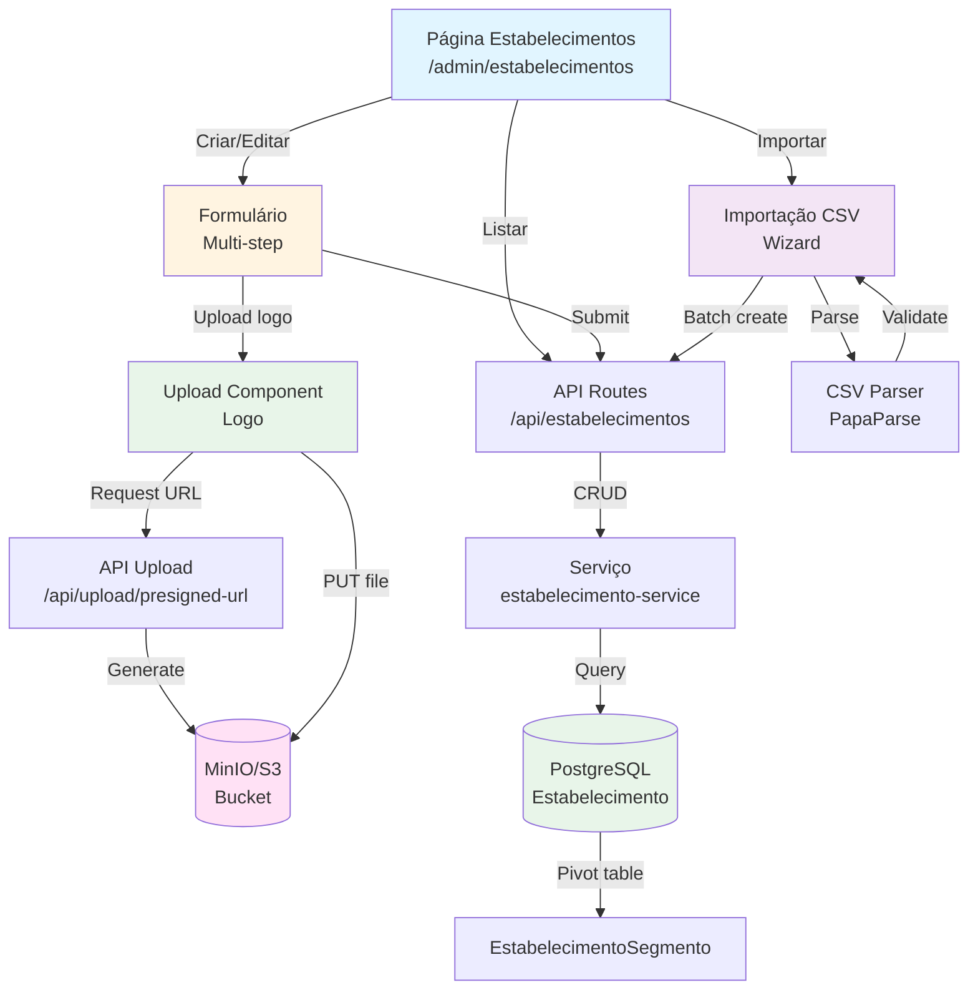

# Plano de Implementação: Gestão de Estabelecimentos

Implementar sistema completo de gestão de estabelecimentos com CRUD, upload de logos para MinIO/S3, associação com múltiplos segmentos, e importação em massa via CSV. Estabelecimentos são as entidades votáveis nas enquetes, representando empresas, lojas, profissionais ou serviços que competem por destaque em suas categorias.

## Visão Geral

O sistema permitirá:
- **CRUD Completo**: Criar, visualizar, editar e desativar estabelecimentos com validação de dados
- **Upload de Logos**: Upload de imagens para MinIO/S3 com geração de presigned URLs e otimização
- **Múltiplos Segmentos**: Associar estabelecimento a vários segmentos simultaneamente (ex: Restaurante + Delivery)
- **Importação CSV**: Importar centenas de estabelecimentos de uma vez com detecção de duplicatas e validação
- **Ativação/Desativação**: Soft delete via flag `ativo` para manter histórico de votos

## Referências

- [MinIO JavaScript SDK](https://min.io/docs/minio/linux/developers/javascript/minio-javascript.html) - Cliente S3
- [PapaParse](https://www.papaparse.com/) - Parser CSV no browser
- PRD Seção 4.1: [.context/inputs/PRD.md](../inputs/PRD.md#41-schema-prisma-completo) - Modelo Estabelecimento
- [agents/backend-development.md](../agents/backend-development.md) - Upload de arquivos
- [agents/frontend-development.md](../agents/frontend-development.md) - Formulários complexos

## Arquitetura



**Notas sobre a arquitetura:**
- **Presigned URLs**: Frontend solicita URL assinada do backend, faz upload direto para MinIO sem passar pelo servidor
- **Tabela Pivot**: EstabelecimentoSegmento permite relação many-to-many entre estabelecimentos e segmentos
- **Soft Delete**: Flag `ativo` ao invés de DELETE para preservar histórico de votos
- **Batch Import**: Importação processa CSV no frontend, envia array de estabelecimentos para API em lote

## Pré-requisitos

1. **RF-001 Implementado**: Autenticação OAuth2 funcional
2. **RF-002 Implementado**: Segmentos criados para associação
3. **MinIO Configurado**: Bucket criado e variáveis de ambiente configuradas
4. **Prisma Client Atualizado**: Schema com modelos Estabelecimento e EstabelecimentoSegmento

## Passo 1: Configuração Inicial

**Agent:** [agents/backend-development.md](../agents/backend-development.md)

### 1.1 Instalar Dependências

**Dependências necessárias:**
- `minio@8.0.1`: Cliente S3 para Node.js (upload de logos)
- `papaparse@5.4.1`: Parser CSV no frontend
- `@types/papaparse@5.3.14`: Types para PapaParse

### 1.2 Variáveis de Ambiente

Usar variáveis existentes do PRD Seção 3:
- `S3_BUCKET`, `S3_REGION`, `S3_ACCESS_KEY_ID`, `S3_SECRET_ACCESS_KEY`, `S3_ENDPOINT`, `S3_PUBLIC_URL`

## Passo 2: Schema do Banco de Dados

**Agent:** [agents/database-development.md](../agents/database-development.md)

### 2.1 Adicionar Modelos ao Prisma Schema

**Estabelecimento**: Representa empresas/serviços votáveis

**Campos:**
- `id` (String @id @default(cuid())): Identificador único
- `organizationId` (String): ID da organização
- `nome` (String): Nome do estabelecimento
- `logoUrl` (String?): URL da logo no MinIO (opcional)
- `descricao` (String?): Descrição breve (opcional)
- `endereco` (String?): Endereço completo (opcional)
- `telefone` (String?): Telefone de contato (opcional)
- `whatsapp` (String?): WhatsApp (opcional)
- `website` (String?): Site (opcional)
- `instagram` (String?): Handle do Instagram (opcional)
- `facebook` (String?): URL do Facebook (opcional)
- `ativo` (Boolean @default(true)): Se está ativo
- `criadoEm` (DateTime @default(now())): Data de criação

**Relações:**
- `segmentos` (EstabelecimentoSegmento[]): Segmentos associados via pivot
- `votos` (VotoEstabelecimento[]): Votos recebidos

**Índices:**
- `@@index([organizationId])`: Buscar por organização
- `@@index([organizationId, ativo])`: Filtrar ativos por organização

**EstabelecimentoSegmento**: Tabela pivot para relação many-to-many

**Campos:**
- `estabelecimentoId` (String): ID do estabelecimento
- `segmentoId` (String): ID do segmento

**Relações:**
- `estabelecimento` (Estabelecimento): Relação com estabelecimento, onDelete: Cascade
- `segmento` (Segmento): Relação com segmento, onDelete: Cascade

**Constraints:**
- `@@id([estabelecimentoId, segmentoId])`: Chave primária composta

### 2.2 Executar Migração

Executar `npx prisma migrate dev --name add-estabelecimento-models`.

## Passo 3: Criar Serviços

**Agent:** [agents/backend-development.md](../agents/backend-development.md)

### 3.1 Serviço MinIO

Criar `src/lib/storage/minio-client.ts` (server-only):

**Função: getMinIOClient**
- Retorna instância configurada do MinIO Client
- Usar variáveis de ambiente para configuração

**Função: generatePresignedUrl**
- Parâmetros: `fileName` (string), `fileType` (string), `organizationId` (string)
- Gera nome único: `${organizationId}/logos/${cuid()}-${fileName}`
- Retorna presigned URL válida por 5 minutos para PUT
- Retorna também URL pública final do arquivo

### 3.2 Serviço de Estabelecimentos

Criar `src/lib/estabelecimentos/estabelecimento-service.ts` (server-only):

**Função: getEstabelecimentos**
- Parâmetros: `organizationId`, `filters` (opcional: segmentoId, ativo, search)
- Retorna array de estabelecimentos com segmentos incluídos
- Suporta busca por nome
- Suporta filtro por segmento
- Ordenar por nome ascendente

**Função: getEstabelecimento**
- Parâmetros: `id`, `organizationId`
- Retorna estabelecimento com segmentos incluídos
- Lançar erro 404 se não encontrado

**Função: createEstabelecimento**
- Parâmetros: `data`, `organizationId`
- Validar que segmentos existem e pertencem à organização
- Criar estabelecimento e associações de segmentos em transação
- Validar limite do plano antes de criar
- Retornar estabelecimento criado com segmentos

**Função: updateEstabelecimento**
- Parâmetros: `id`, `data`, `organizationId`
- Verificar propriedade
- Atualizar estabelecimento e segmentos em transação
- Deletar associações antigas e criar novas se segmentos mudaram

**Função: toggleEstabelecimento**
- Parâmetros: `id`, `organizationId`
- Alternar flag `ativo` (soft delete)
- Não permitir desativar se houver votos pendentes em enquetes ativas

**Função: importEstabelecimentos**
- Parâmetros: `data` (array), `organizationId`
- Validar limite do plano (count + array.length)
- Detectar duplicatas por nome (case insensitive)
- Criar em batch usando transação
- Retornar estatísticas: criados, duplicatas, erros

**Tratamento de Erros:**
- Estabelecimento não encontrado: 404
- Segmento inválido: 400 com lista de IDs inválidos
- Limite atingido: 409 com mensagem de upgrade
- Duplicata na importação: Incluir em relatório, não bloquear batch

## Passo 4: API Routes

**Agent:** [agents/backend-development.md](../agents/backend-development.md)

### 4.1 Listar Estabelecimentos - GET

Criar `src/app/api/estabelecimentos/route.ts`:

**Endpoint:** `GET /api/estabelecimentos`

**Query Parameters:**
- `segmentoId` (string, opcional): Filtrar por segmento
- `ativo` (boolean, opcional): Filtrar por status
- `search` (string, opcional): Buscar por nome

**Lógica:**
1. Extrair organizationId
2. Parsear query params
3. Chamar `getEstabelecimentos(organizationId, filters)`
4. Retornar array

**Respostas:**
- `200 OK`: Array de estabelecimentos

### 4.2 Criar Estabelecimento - POST

**Endpoint:** `POST /api/estabelecimentos`

**Validação (Zod):**
- Obrigatórios: `nome` (string, min 1), `segmentoIds` (array de strings, min 1)
- Opcionais: `logoUrl`, `descricao`, `endereco`, `telefone`, `whatsapp`, `website`, `instagram`, `facebook`

**Lógica:**
1. Validar body
2. Extrair organizationId
3. Chamar `createEstabelecimento(data, organizationId)`
4. Retornar estabelecimento criado

**Respostas:**
- `201 Created`: Estabelecimento criado
- `400 Bad Request`: Validação falhou
- `409 Conflict`: Limite atingido

### 4.3 Atualizar Estabelecimento - PUT

Criar `src/app/api/estabelecimentos/[id]/route.ts`:

**Endpoint:** `PUT /api/estabelecimentos/[id]`

**Validação:** Mesma do POST, todos campos opcionais com `.partial()`

**Lógica:**
1. Validar body
2. Extrair organizationId e id
3. Chamar `updateEstabelecimento(id, data, organizationId)`
4. Retornar estabelecimento atualizado

**Respostas:**
- `200 OK`: Estabelecimento atualizado
- `404 Not Found`: Não encontrado

### 4.4 Ativar/Desativar - PATCH

**Endpoint:** `PATCH /api/estabelecimentos/[id]/toggle`

**Lógica:**
1. Extrair organizationId e id
2. Chamar `toggleEstabelecimento(id, organizationId)`
3. Retornar estabelecimento atualizado

**Respostas:**
- `200 OK`: Status alterado
- `409 Conflict`: Não pode desativar (votos pendentes)

### 4.5 Importar CSV - POST

Criar `src/app/api/estabelecimentos/import/route.ts`:

**Endpoint:** `POST /api/estabelecimentos/import`

**Validação (Zod):**
- `estabelecimentos` (array de objetos com nome, segmentoIds, campos opcionais)

**Lógica:**
1. Validar array
2. Extrair organizationId
3. Chamar `importEstabelecimentos(estabelecimentos, organizationId)`
4. Retornar estatísticas

**Respostas:**
- `200 OK`: {criados: number, duplicatas: string[], erros: string[]}
- `409 Conflict`: Limite atingido

### 4.6 Presigned URL - POST

Criar `src/app/api/upload/presigned-url/route.ts`:

**Endpoint:** `POST /api/upload/presigned-url`

**Validação (Zod):**
- `fileName` (string): Nome do arquivo
- `fileType` (string): MIME type (validar image/*)

**Lógica:**
1. Validar que fileType é imagem
2. Extrair organizationId
3. Chamar `generatePresignedUrl(fileName, fileType, organizationId)`
4. Retornar URLs

**Respostas:**
- `200 OK`: {uploadUrl: string, publicUrl: string}
- `400 Bad Request`: Tipo de arquivo inválido

## Passo 5: Interface Frontend

**Agent:** [agents/frontend-development.md](../agents/frontend-development.md)

### 5.1 Página de Estabelecimentos

Criar `src/app/(admin)/admin/estabelecimentos/page.tsx`:

**Rota:** `/admin/estabelecimentos`

**Implementação:**
- Usar hook `useEstabelecimentos()`
- Exibir tabela com colunas: Logo, Nome, Segmentos, Status, Ações
- Filtros: Segmento (select), Status (toggle), Busca (input)
- Botões: "Novo Estabelecimento", "Importar CSV"
- Ações por linha: Editar, Ativar/Desativar

**UI Components:**
- DataTable com paginação
- Badge para cada segmento
- Avatar para logo (fallback com iniciais)
- Switch para ativar/desativar
- Empty state com ilustração

### 5.2 Formulário de Estabelecimento

Criar `src/components/admin/estabelecimento-form.tsx`:

**Props:**
- `estabelecimento` (opcional): Para modo edição
- `onSuccess` (callback): Após salvar

**Formulário Multi-step:**
1. **Informações Básicas**: Nome, Descrição, Segmentos (multi-select)
2. **Logo**: Upload com preview e crop
3. **Contatos**: Telefone, WhatsApp, Website, Redes Sociais
4. **Endereço**: Campo de texto livre

**Validação:**
- Schema Zod alinhado com API
- Validação em tempo real
- Pelo menos 1 segmento obrigatório

**Upload de Logo:**
- Componente de upload com drag-and-drop
- Preview da imagem
- Crop opcional (react-image-crop)
- Ao selecionar arquivo:
  1. Request presigned URL
  2. Upload direto para MinIO via PUT
  3. Salvar publicUrl no form

### 5.3 Importação CSV

Criar `src/components/admin/import-estabelecimentos-wizard.tsx`:

**Steps:**
1. **Upload CSV**: Drag-and-drop ou file picker
2. **Mapeamento**: Mapear colunas CSV para campos
3. **Validação**: Exibir preview com erros destacados
4. **Confirmação**: Estatísticas e botão importar

**Formato CSV Esperado:**
```csv
nome,segmentos,telefone,whatsapp,website,instagram
Restaurante A,"restaurantes,delivery",1199999999,1199999999,https://site.com,@restaurantea
```

**Lógica:**
- Parsear CSV com PapaParse
- Validar cada linha
- Permitir corrigir erros inline
- Ao confirmar, chamar API de importação
- Exibir resultado com sucessos e falhas

### 5.4 Criar Hooks

Criar `src/hooks/use-estabelecimentos.ts`:

**useEstabelecimentos**: Buscar estabelecimentos com filtros
**useEstabelecimento**: Buscar um estabelecimento por ID
**useCreateEstabelecimento**: Criar estabelecimento
**useUpdateEstabelecimento**: Atualizar estabelecimento
**useToggleEstabelecimento**: Ativar/desativar
**useImportEstabelecimentos**: Importar batch
**usePresignedUrl**: Obter URL para upload

Todos com cache invalidation apropriada.

### 5.5 Navegação

Atualizar sidebar:
- Item "Estabelecimentos" com ícone `Store`
- URL: `/admin/estabelecimentos`

## Passo 6: Testes

**Agent:** [agents/qa-agent.md](../agents/qa-agent.md)

### 6.1 Testes de CRUD

**Cenário 1: Criar estabelecimento com logo**
1. Clicar "Novo Estabelecimento"
2. Preencher nome "Restaurante Teste"
3. Selecionar 2 segmentos
4. Upload de logo
5. Preencher contatos
6. Salvar
7. **Resultado esperado**: Estabelecimento criado, logo visível

**Cenário 2: Editar estabelecimento**
1. Selecionar estabelecimento
2. Alterar nome e segmentos
3. Salvar
4. **Resultado esperado**: Alterações aplicadas

**Cenário 3: Desativar estabelecimento**
1. Clicar toggle "Ativo"
2. Confirmar
3. **Resultado esperado**: Status alterado para inativo

### 6.2 Testes de Importação

**Cenário 1: Importar CSV válido**
1. Clicar "Importar CSV"
2. Upload arquivo com 10 linhas válidas
3. Mapear colunas
4. Confirmar
5. **Resultado esperado**: 10 estabelecimentos criados

**Cenário 2: Detectar duplicatas**
1. Importar CSV com nomes duplicados
2. **Resultado esperado**: Duplicatas listadas, não criadas

### 6.3 Testes de Upload

**Cenário 1: Upload de logo**
1. Selecionar imagem PNG
2. **Resultado esperado**: Preview exibido, upload para MinIO
3. Salvar estabelecimento
4. **Resultado esperado**: Logo visível na listagem

## Checklist de Implementação

### Setup
- [ ] Instalar `minio@8.0.1`
- [ ] Instalar `papaparse@5.4.1`
- [ ] Instalar `@types/papaparse@5.3.14`

### Banco de Dados
- [ ] Adicionar modelo `Estabelecimento`
- [ ] Adicionar modelo `EstabelecimentoSegmento`
- [ ] Adicionar índices
- [ ] Executar migração

### Serviços
- [ ] Criar `minio-client.ts`
- [ ] Implementar `generatePresignedUrl`
- [ ] Criar `estabelecimento-service.ts`
- [ ] Implementar todas as funções CRUD
- [ ] Implementar `importEstabelecimentos`

### API Routes
- [ ] Implementar GET `/api/estabelecimentos`
- [ ] Implementar POST `/api/estabelecimentos`
- [ ] Implementar PUT `/api/estabelecimentos/[id]`
- [ ] Implementar PATCH `/api/estabelecimentos/[id]/toggle`
- [ ] Implementar POST `/api/estabelecimentos/import`
- [ ] Implementar POST `/api/upload/presigned-url`

### Frontend
- [ ] Criar página de estabelecimentos
- [ ] Criar formulário multi-step
- [ ] Implementar upload de logo
- [ ] Criar wizard de importação
- [ ] Criar todos os hooks
- [ ] Atualizar navegação

### Qualidade
- [ ] Testar CRUD completo
- [ ] Testar upload de imagens
- [ ] Testar importação CSV
- [ ] Testar filtros e busca
- [ ] Testar isolamento multi-tenant
- [ ] Verificar performance com 1000+ estabelecimentos

## Notas Importantes

1. **Presigned URLs**: Upload direto para MinIO sem passar pelo servidor economiza banda e melhora performance
2. **Soft Delete**: Nunca deletar estabelecimentos com votos, apenas desativar
3. **Validação de Imagens**: Aceitar apenas PNG, JPG, WEBP com tamanho máximo 2MB
4. **CSV Encoding**: Suportar UTF-8 com BOM para caracteres especiais
5. **Batch Size**: Limitar importação a 1000 estabelecimentos por vez
6. **Segmentos Obrigatórios**: Todo estabelecimento deve ter pelo menos 1 segmento

## Referências de Documentação

- **Agents:**
  - [agents/database-development.md](../agents/database-development.md)
  - [agents/backend-development.md](../agents/backend-development.md)
  - [agents/frontend-development.md](../agents/frontend-development.md)

- **Documentação:**
  - [.context/inputs/PRD.md](../inputs/PRD.md) - Seção 4.1
  - [MinIO Docs](https://min.io/docs/minio/linux/developers/javascript/minio-javascript.html)
  - [PapaParse Docs](https://www.papaparse.com/)
