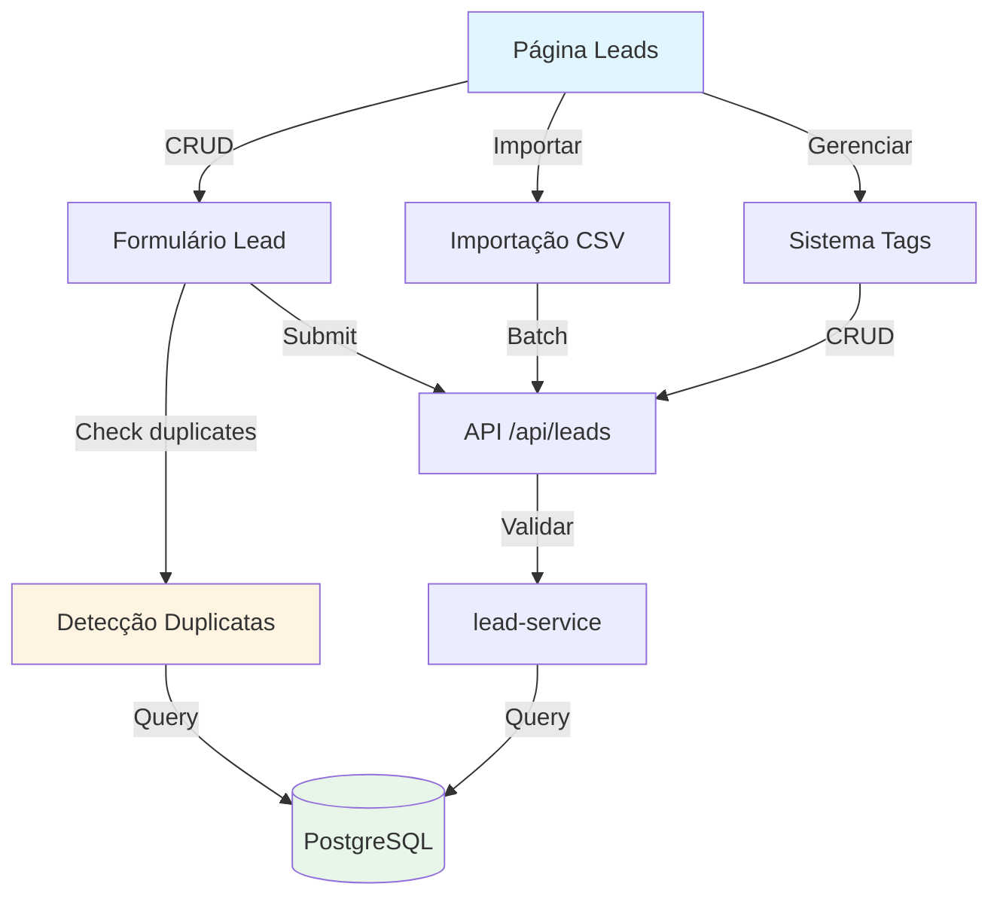

# Plano de Implementação: Gestão de Leads

Sistema completo de gestão de leads com CRUD, sistema de tags, detecção de duplicatas por WhatsApp/email, importação CSV em massa, e controle de opt-out para conformidade LGPD. Leads são os respondentes das enquetes que receberão links personalizados via WhatsApp.

## Visão Geral

- **CRUD com Validação**: Criar, editar e gerenciar leads com validação de WhatsApp e email
- **Sistema de Tags**: Organizar leads em grupos para segmentação de campanhas (ex: "VIP", "Região Norte")
- **Detecção de Duplicatas**: Identificar leads duplicados por WhatsApp ou email antes de criar
- **Importação CSV**: Importar milhares de leads com mapeamento de colunas e validação
- **Opt-out e LGPD**: Sistema de descadastro e registro de consentimento

## Referências

- PRD Seção 4.1: [.context/inputs/PRD.md](../inputs/PRD.md#leads-e-tags)
- [agents/backend-development.md](../agents/backend-development.md)
- [agents/frontend-development.md](../agents/frontend-development.md)

## Arquitetura



## Pré-requisitos

1. **RF-001 Implementado**: Autenticação OAuth2
2. **Prisma Schema Atualizado**: Modelos Lead, Tag, LeadTag

## Passo 1: Configuração

**Agent:** [agents/backend-development.md](../agents/backend-development.md)

### 1.1 Dependências

- `libphonenumber-js@1.10.51`: Validação e formatação de números de telefone

## Passo 2: Schema do Banco de Dados

**Agent:** [agents/database-development.md](../agents/database-development.md)

### 2.1 Modelos Prisma

**Lead**:
- `id`, `organizationId`, `nome`, `sexo`, `email`, `telefone`, `whatsapp` (obrigatório)
- `facebook`, `instagram`, `statusVerificacao`, `optOut`, `optOutEm`
- `origem` (MANUAL, IMPORTACAO, FORMULARIO_WEB), `consentimentoEm`
- `criadoEm`, `ultimaInteracao`
- Relações: `tags` (LeadTag[]), `trackingLinks`, `respostas`
- Índices: `[organizationId]`, `[organizationId, whatsapp]`, `[organizationId, email]`

**Tag**:
- `id`, `organizationId`, `nome`, `cor` (hex)
- Relações: `leads` (LeadTag[])
- Constraint: `@@unique([organizationId, nome])`

**LeadTag**: Tabela pivot
- `leadId`, `tagId`
- `@@id([leadId, tagId])`

**Enums**: `Sexo`, `VerificacaoStatus`, `OrigemLead`

### 2.2 Migração

`npx prisma migrate dev --name add-lead-models`

## Passo 3: Serviços

**Agent:** [agents/backend-development.md](../agents/backend-development.md)

### 3.1 Serviço de Leads

Criar `src/lib/leads/lead-service.ts`:

**getLeads**: Buscar com filtros (tags, status, search)
**getLead**: Buscar por ID
**createLead**: Criar com validação de duplicatas e limite
**updateLead**: Atualizar dados
**checkDuplicate**: Verificar se WhatsApp ou email já existe
**importLeads**: Importação em batch com detecção de duplicatas
**optOutLead**: Marcar lead como opt-out

**Validações:**
- WhatsApp: Validar formato com libphonenumber-js
- Email: Validar formato com regex
- Duplicatas: Buscar por whatsapp OU email (case insensitive)

### 3.2 Serviço de Tags

Criar `src/lib/leads/tag-service.ts`:

**getTags**: Listar tags da organização
**createTag**: Criar tag com validação de nome único
**updateTag**: Atualizar nome/cor
**deleteTag**: Excluir se não tiver leads vinculadas

## Passo 4: API Routes

**Agent:** [agents/backend-development.md](../agents/backend-development.md)

### 4.1 Leads

- `GET /api/leads`: Listar com filtros (tags, search, status)
- `POST /api/leads`: Criar com validação de duplicatas
- `PUT /api/leads/[id]`: Atualizar
- `POST /api/leads/check-duplicate`: Verificar duplicata
- `POST /api/leads/import`: Importar CSV
- `PATCH /api/leads/[id]/opt-out`: Marcar opt-out

### 4.2 Tags

- `GET /api/tags`: Listar
- `POST /api/tags`: Criar
- `PUT /api/tags/[id]`: Atualizar
- `DELETE /api/tags/[id]`: Excluir

**Validação Zod**: Todos os endpoints com schemas apropriados

## Passo 5: Interface Frontend

**Agent:** [agents/frontend-development.md](../agents/frontend-development.md)

### 5.1 Página de Leads

`src/app/(admin)/admin/leads/page.tsx`:

- DataTable com colunas: Nome, WhatsApp, Email, Tags, Status, Ações
- Filtros: Tags (multi-select), Status, Busca
- Botões: "Novo Lead", "Importar CSV"
- Ações: Editar, Opt-out

### 5.2 Formulário de Lead

`src/components/admin/lead-form.tsx`:

- Campos: Nome, Sexo, Email, Telefone, WhatsApp (obrigatório)
- Redes sociais: Facebook, Instagram
- Tags: Multi-select com autocomplete e criação inline
- Validação em tempo real
- Detecção de duplicatas ao digitar WhatsApp/email

### 5.3 Importação CSV

`src/components/admin/import-leads-wizard.tsx`:

**Steps**:
1. Upload CSV
2. Mapeamento de colunas
3. Preview com validação
4. Confirmação e importação

**Formato CSV**:
```csv
nome,whatsapp,email,sexo,tags
João Silva,5562999998888,joao@email.com,M,"vip,regiao-norte"
```

### 5.4 Gestão de Tags

`src/components/admin/tags-manager.tsx`:

- Modal com lista de tags
- Criar, editar, excluir tags
- Color picker para cada tag
- Exibir contagem de leads por tag

### 5.5 Hooks

`src/hooks/use-leads.ts`:
- `useLeads()`, `useLead()`, `useCreateLead()`, `useUpdateLead()`
- `useCheckDuplicate()`, `useImportLeads()`, `useOptOutLead()`

`src/hooks/use-tags.ts`:
- `useTags()`, `useCreateTag()`, `useUpdateTag()`, `useDeleteTag()`

### 5.6 Navegação

Sidebar: "Leads" com ícone `Users`

## Passo 6: Testes

**Agent:** [agents/qa-agent.md](../agents/qa-agent.md)

### 6.1 CRUD
- Criar lead com tags
- Editar lead e alterar tags
- Detectar duplicata por WhatsApp
- Detectar duplicata por email

### 6.2 Importação
- Importar CSV válido com 100 leads
- Detectar duplicatas na importação
- Validar formato de WhatsApp

### 6.3 Tags
- Criar tag
- Associar lead a múltiplas tags
- Filtrar leads por tag
- Excluir tag sem leads

### 6.4 Opt-out
- Marcar lead como opt-out
- Verificar que não aparece em campanhas

## Checklist

### Setup
- [ ] Instalar `libphonenumber-js`

### Banco de Dados
- [ ] Adicionar modelos Lead, Tag, LeadTag
- [ ] Adicionar enums
- [ ] Executar migração

### Serviços
- [ ] Implementar lead-service.ts
- [ ] Implementar tag-service.ts
- [ ] Adicionar validação de WhatsApp
- [ ] Implementar detecção de duplicatas

### API
- [ ] Implementar rotas de leads
- [ ] Implementar rotas de tags
- [ ] Adicionar validação Zod

### Frontend
- [ ] Criar página de leads
- [ ] Criar formulário com detecção de duplicatas
- [ ] Criar wizard de importação
- [ ] Criar gerenciador de tags
- [ ] Implementar todos os hooks

### Qualidade
- [ ] Testar CRUD completo
- [ ] Testar importação CSV
- [ ] Testar detecção de duplicatas
- [ ] Testar sistema de tags
- [ ] Testar opt-out

## Notas Importantes

1. **WhatsApp Obrigatório**: Todo lead DEVE ter WhatsApp válido (formato internacional)
2. **Duplicatas**: Verificar por WhatsApp OU email (case insensitive)
3. **Tags Inline**: Permitir criar tags durante criação de lead
4. **Opt-out Permanente**: Lead com opt-out NUNCA aparece em campanhas
5. **LGPD**: Registrar data de consentimento ao criar lead
6. **Importação**: Limitar a 5000 leads por importação

## Referências

- [agents/backend-development.md](../agents/backend-development.md)
- [agents/frontend-development.md](../agents/frontend-development.md)
- [libphonenumber-js](https://www.npmjs.com/package/libphonenumber-js)
