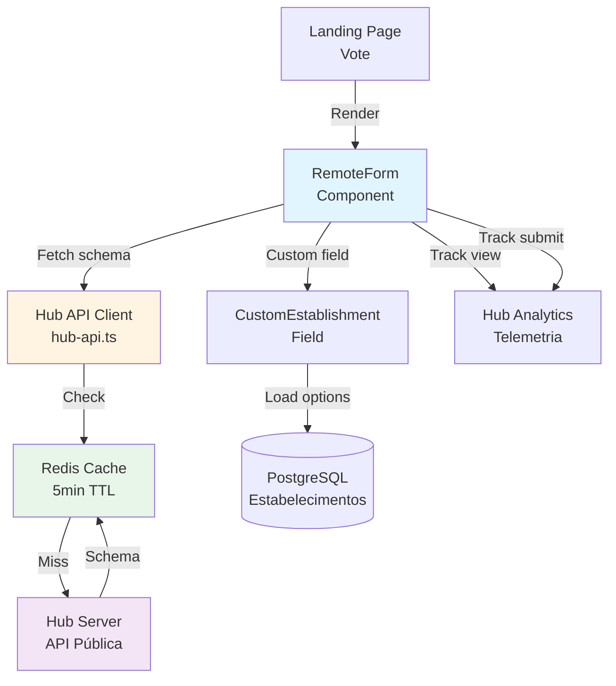

# Plano de Implementação: Integração com FormBuilder Hub

Implementar consumo completo da API pública do FormBuilder Hub para buscar schemas de formulários, renderizar formulários dinamicamente, e enviar telemetria de analytics. Esta integração é fundamental para reutilizar 100% do engine de formulários do Hub sem duplicar código.

## Visão Geral

- **Consumo de Schemas**: Buscar definição de formulários via API pública do Hub
- **Renderização Dinâmica**: Renderizar formulários usando RemoteForm component
- **Campo Customizado**: Implementar campo `custom-establishment` para seleção de estabelecimentos
- **Telemetria**: Enviar eventos de visualização e submissão para analytics do Hub
- **Cache Inteligente**: Cachear schemas localmente com invalidação apropriada

## Referências

- PRD Seção 7.1: [.context/inputs/PRD.md](../inputs/PRD.md#71-formbuilder-hub---api-pública)
- Hub: `docs/API.md` - Documentação da API pública
- [agents/backend-development.md](../agents/backend-development.md)
- [agents/frontend-development.md](../agents/frontend-development.md)

## Arquitetura



## Pré-requisitos

1. **RF-001 Implementado**: Autenticação OAuth2
2. **RF-003 Implementado**: Estabelecimentos cadastrados
3. **Hub API Key**: API key pública configurada no Hub
4. **Redis Configurado**: Para cache de schemas

## Passo 1: Configuração

**Agent:** [agents/backend-development.md](../agents/backend-development.md)

### 1.1 Dependências

- `axios@1.6.2`: Cliente HTTP para chamadas à API do Hub
- `zod@3.22.4`: Validação de schemas do Hub

### 1.2 Variáveis de Ambiente

Usar variáveis existentes:
- `HUB_URL`: URL pública do Hub
- `HUB_API_KEY`: API key pública (escopo: read forms + write analytics)

## Passo 2: Cliente da API do Hub

**Agent:** [agents/backend-development.md](../agents/backend-development.md)

### 2.1 Hub API Client

Criar `src/lib/hub/hub-api-client.ts` (server-only):

**Função: getFormSchema**
- Parâmetros: `publicId` (string)
- Endpoint: `GET ${HUB_URL}/api/public/v1/forms/${publicId}`
- Headers: `Authorization: Bearer ${HUB_API_KEY}`
- Retorno: Schema do formulário com campos, validações, settings
- Cache: Redis com TTL de 5 minutos
- Tratamento de erros: 404 se formulário não existe, 401 se API key inválida

**Função: sendAnalyticsEvent**
- Parâmetros: `formId` (string), `eventType` ("view" | "submission_complete"), `metadata` (opcional)
- Endpoint: `POST ${HUB_URL}/api/public/v1/analytics`
- Headers: `Authorization: Bearer ${HUB_API_KEY}`
- Body: `{formId, eventType, metadata}`
- Fire-and-forget: Não bloquear se falhar

**Função: validateFormSchema**
- Parâmetros: `schema` (unknown)
- Validar estrutura do schema usando Zod
- Verificar que `storageMode === "LOCAL"`
- Lançar erro se schema inválido

### 2.2 Cache Service

Criar `src/lib/cache/redis-cache.ts`:

**Função: getCachedFormSchema**
- Key: `form:schema:${publicId}`
- TTL: 5 minutos
- Retornar null se não existe

**Função: setCachedFormSchema**
- Salvar schema no Redis com TTL

## Passo 3: API Routes

**Agent:** [agents/backend-development.md](../agents/backend-development.md)

### 3.1 Proxy para Form Schema

Criar `src/app/api/forms/[publicId]/schema/route.ts`:

**Endpoint:** `GET /api/forms/[publicId]/schema`

**Lógica:**
1. Verificar cache Redis
2. Se miss, buscar do Hub via `getFormSchema(publicId)`
3. Validar schema
4. Cachear no Redis
5. Retornar schema

**Respostas:**
- `200 OK`: Schema do formulário
- `404 Not Found`: Formulário não existe
- `500 Internal Server Error`: Erro ao buscar do Hub

### 3.2 Enviar Telemetria

Criar `src/app/api/analytics/track/route.ts`:

**Endpoint:** `POST /api/analytics/track`

**Validação (Zod):**
- `formId` (string): ID do formulário
- `eventType` ("view" | "submission_complete")
- `metadata` (objeto opcional)

**Lógica:**
1. Validar body
2. Chamar `sendAnalyticsEvent(formId, eventType, metadata)`
3. Retornar sucesso (mesmo se telemetria falhar)

**Respostas:**
- `200 OK`: Telemetria enviada (ou tentada)

## Passo 4: RemoteForm Component

**Agent:** [agents/frontend-development.md](../agents/frontend-development.md)

### 4.1 Componente RemoteForm

Criar `src/components/forms/RemoteForm.tsx`:

**Props:**
- `publicId` (string): ID público do formulário
- `onSubmit` (função): Callback ao submeter
- `defaultValues` (objeto opcional): Valores iniciais
- `customFields` (objeto opcional): Implementações de campos customizados

**Implementação:**
1. Buscar schema via `useFormSchema(publicId)`
2. Registrar visualização via `useTrackView(formId)`
3. Renderizar campos dinamicamente baseado no schema
4. Aplicar validações do schema
5. Ao submeter, chamar `onSubmit` e registrar telemetria

**Renderização de Campos:**
- Mapear tipo de campo para componente apropriado
- Tipos suportados: text, email, tel, textarea, select, radio, checkbox, rating-stars
- Tipo especial: `custom-establishment` → CustomEstablishmentField

**Validação:**
- Usar Zod para validar baseado no schema
- Validação em tempo real
- Mensagens de erro do schema

### 4.2 Custom Establishment Field

Criar `src/components/forms/CustomEstablishmentField.tsx`:

**Props:**
- `field` (objeto): Definição do campo do schema
- `value` (string): ID do estabelecimento selecionado
- `onChange` (função): Callback ao selecionar

**Implementação:**
1. Extrair `segmentFilter` do field config
2. Buscar estabelecimentos via `useEstabelecimentos({segmentoId: segmentFilter, ativo: true})`
3. Renderizar Combobox com busca
4. Exibir logo e nome do estabelecimento
5. Ao selecionar, chamar `onChange(estabelecimentoId)`

**UI:**
- Combobox com busca (shadcn/ui)
- Avatar com logo do estabelecimento
- Nome e segmento exibidos
- Empty state se nenhum estabelecimento

### 4.3 Hooks

Criar `src/hooks/use-form-schema.ts`:

**useFormSchema**: Buscar schema do formulário
- Query key: `['form', 'schema', publicId]`
- API: `GET /api/forms/[publicId]/schema`
- staleTime: 5 minutos (alinhado com cache Redis)

**useTrackView**: Registrar visualização
- Mutation que chama `POST /api/analytics/track`
- Executar automaticamente ao montar RemoteForm
- Não bloquear se falhar

**useTrackSubmit**: Registrar submissão
- Mutation que chama `POST /api/analytics/track`
- Executar após submissão bem-sucedida

## Passo 5: Integração na Landing Page

**Agent:** [agents/frontend-development.md](../agents/frontend-development.md)

### 5.1 Página de Votação

Atualizar `src/app/(public)/vote/[hash]/page.tsx`:

**Implementação:**
1. Buscar tracking link por hash
2. Validar que não expirou e não foi usado
3. Buscar enquete e form publicId
4. Renderizar RemoteForm com publicId
5. Ao submeter:
   - Salvar resposta localmente
   - Extrair votos de campos `custom-establishment`
   - Criar registros VotoEstabelecimento
   - Registrar telemetria
   - Redirecionar para página de agradecimento

**Custom Fields Config:**
```typescript
const customFields = {
  'custom-establishment': CustomEstablishmentField
}
```

## Passo 6: Testes

**Agent:** [agents/qa-agent.md](../agents/qa-agent.md)

### 6.1 Integração com Hub

**Cenário 1: Buscar schema do Hub**
1. Configurar API key do Hub
2. Chamar `GET /api/forms/[publicId]/schema`
3. Verificar schema retornado
4. Verificar storageMode=LOCAL
5. **Resultado esperado**: Schema válido retornado

**Cenário 2: Cache de schema**
1. Buscar schema pela primeira vez
2. Verificar chamada ao Hub
3. Buscar novamente em < 5 minutos
4. Verificar que não chamou Hub (cache hit)
5. **Resultado esperado**: Cache funcionando

### 6.2 RemoteForm

**Cenário 1: Renderizar formulário do Hub**
1. Criar formulário no Hub com campos variados
2. Renderizar RemoteForm com publicId
3. Verificar todos os campos exibidos
4. Verificar validações aplicadas
5. **Resultado esperado**: Formulário renderizado corretamente

**Cenário 2: Campo custom-establishment**
1. Formulário com campo `custom-establishment`
2. Verificar dropdown com estabelecimentos
3. Filtrar por segmento
4. Selecionar estabelecimento
5. **Resultado esperado**: Seleção funcional

### 6.3 Telemetria

**Cenário 1: Registrar visualização**
1. Acessar landing page
2. Verificar POST para `/api/analytics/track` com eventType=view
3. Verificar no Hub que evento foi registrado
4. **Resultado esperado**: Visualização contabilizada

**Cenário 2: Registrar submissão**
1. Submeter formulário
2. Verificar POST para `/api/analytics/track` com eventType=submission_complete
3. Verificar no Hub que submissão foi registrada
4. **Resultado esperado**: Submissão contabilizada

## Checklist

### Setup
- [ ] Instalar `axios@1.6.2`
- [ ] Configurar `HUB_API_KEY` no .env

### Hub API Client
- [ ] Criar `hub-api-client.ts`
- [ ] Implementar `getFormSchema()`
- [ ] Implementar `sendAnalyticsEvent()`
- [ ] Implementar `validateFormSchema()`
- [ ] Criar `redis-cache.ts`
- [ ] Implementar cache de schemas

### API Routes
- [ ] Implementar `GET /api/forms/[publicId]/schema`
- [ ] Implementar `POST /api/analytics/track`
- [ ] Adicionar validação Zod

### RemoteForm
- [ ] Criar componente `RemoteForm.tsx`
- [ ] Implementar renderização dinâmica de campos
- [ ] Implementar validação com Zod
- [ ] Criar `CustomEstablishmentField.tsx`
- [ ] Implementar busca de estabelecimentos
- [ ] Criar hooks `useFormSchema`, `useTrackView`, `useTrackSubmit`

### Integração
- [ ] Atualizar landing page de votação
- [ ] Integrar RemoteForm
- [ ] Implementar extração de votos
- [ ] Testar fluxo completo

### Qualidade
- [ ] Testar busca de schema do Hub
- [ ] Testar cache Redis
- [ ] Testar renderização de formulário
- [ ] Testar campo custom-establishment
- [ ] Testar telemetria
- [ ] Verificar que storageMode=LOCAL
- [ ] Testar com formulário complexo (10+ campos)

## Notas Importantes

1. **Storage Mode**: SEMPRE verificar que `storageMode === "LOCAL"`. Formulários com `storageMode === "HUB"` não devem ser usados no Spoke.
2. **API Key Scope**: API key deve ter apenas escopos `read:forms` e `write:analytics`. Nunca expor no client.
3. **Cache TTL**: 5 minutos é suficiente para reduzir chamadas ao Hub sem deixar schemas muito desatualizados.
4. **Telemetria Assíncrona**: Nunca bloquear UX se telemetria falhar. Fire-and-forget.
5. **Validação de Schema**: Sempre validar schema do Hub antes de usar para evitar erros de runtime.
6. **Custom Fields**: Apenas `custom-establishment` é suportado. Outros campos customizados devem ser ignorados.
7. **Error Handling**: Se Hub estiver offline, usar schema cacheado se disponível. Exibir erro amigável se não houver cache.

## Referências

- **Agents:**
  - [agents/backend-development.md](../agents/backend-development.md)
  - [agents/frontend-development.md](../agents/frontend-development.md)

- **Documentação:**
  - [.context/inputs/PRD.md](../inputs/PRD.md) - Seção 7.1
  - Hub: `docs/API.md` - API pública
  - Hub: `docs/SPOKE_IMPLEMENTATION_GUIDE.md` - Guia de integração
