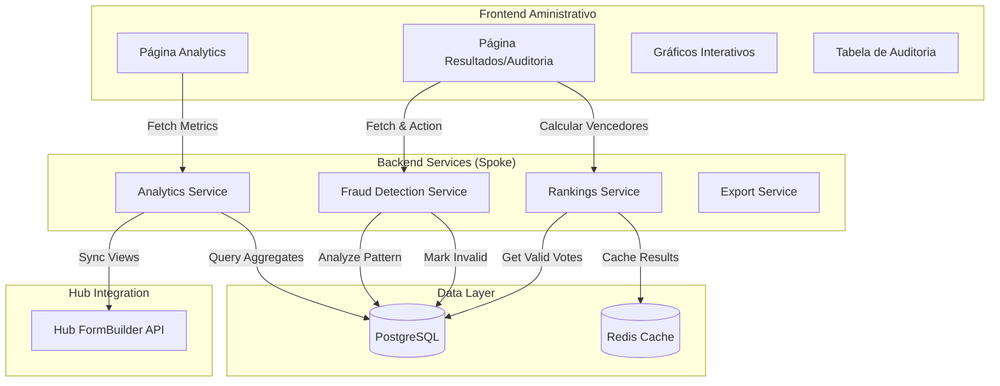

# Plano de Implementação: Analytics Avançado e Resultados com Auditoria

Este plano detalha a implementação das telas de **Analytics** e **Resultados** (Apuração/Auditoria) para o sistema de Prêmios. O objetivo é entregar "Ouro Refinado" para o gestor: insights valiosos, métricas de engajamento detalhadas e ferramentas robustas contra fraudes.

## Visão Geral

O sistema oferecerá duas novas seções administrativas ricas em dados:
- **Analytics (Inteligência)**: Foco em performance do funil, engajamento dos eleitores e eficácia das campanhas.
- **Resultados (Auditoria & Apuração)**: Foco na integridade da votação, detecção de tráfego inválido/fraude e validação final dos vencedores.

### Funcionalidades Chave
- **Dashboard de Engajamento**: KPIs de visualizações, votos, abandono (% de desistência), tempo médio e taxa de conversão.
- **Funil de Conversão Granular**: Campanhas (Enviados) -> Aberturas -> Cliques -> Votos Iniciados -> Votos Concluídos.
- **Detector de Fraudes (Sentinela)**: Análise automática de votos baseada em padrões de IP, User-Agent, Velocidade (interação robótica) e Geolocalização (se disponível).
- **Mesa de Auditoria**: Interface para o auditor filtrar votos suspeitos, invalidar fraudes em massa e recalcular rankings em tempo real.

## Referências

- PRD Seção 4 (Modelo de Dados) e 12 (Resultados): [.context/inputs/PRD.md](../inputs/PRD.md)
- Plano Base de Rankings: [RF-009-resultados-rankings.md](./RF-009-resultados-rankings.md)
- Biblioteca de Gráficos: [Recharts](https://recharts.org/)
- Biblioteca de Tabelas: [TanStack Table](https://tanstack.com/table/v8)

## Arquitetura

**Decisões Arquiteturais:**
1.  **Auditoria Post-Mortem e Real-Time**: A detecção de fraude rodará de forma assíncrona (via Jobs) para não impactar a performance do voto, mas também poderá ser disparada manualmente na tela de Auditoria.
2.  **Separação de "Votos Totais" vs "Votos Válidos"**: Os rankings considerarão apenas respostas com status `VALID`.
3.  **Local vs Hub**: Métricas de "Visualização" da página de votação serão sincronizadas do Hub (que detém a telemetria do formulário) ou inferidas via `TrackingLink` para garantir precisão no funil off-whatsapp.

## Pré-requisitos

1.  **RF-008 (Votação)** implementado e gerando dados de `Resposta`.
2.  **Configuração do Hub**: Acesso à API do Hub para obter contagem de `views` do formulário (se disponível).

## Passo 1: Configuração Inicial

### 1.1 Dependências

**Agent:** [agents/frontend-development.md](../../../../.agent/agents/frontend-development.md)

- `recharts`: Para visualização de dados (gráficos de linha, área, pizza).
- `@tanstack/react-table`: Para a tabela avançada de auditoria (ordenação, filtros, seleção em massa).
- `date-fns`: Manipulação de datas nos gráficos.

## Passo 2: Schema do Banco de Dados

**Agent:** [agents/database-development.md](../../../../.agent/agents/database-development.md)

Precisamos refinar o modelo de `Resposta` para suportar status de auditoria e métricas de tempo.

### 2.1 Modificar Modelo `Resposta`

Adicionar campos de controle de qualidade e auditoria.

**Modelo: Resposta**
- `status` (Enum: `VALID`, `SUSPICIOUS`, `INVALID`, `MANUAL_REVIEW`): @default(`VALID`)
- `fraudScore` (Int): 0 a 100, onde 100 é alta probabilidade de fraude. @default(0)
- `fraudReason` (String?): Motivo da marcação (ex: "IP Duplicado", "Bot Velocity").
- `reviewedBy` (String?): ID do usuário admin que auditou manualmente.
- `reviewedAt` (DateTime?): Data da auditoria manual.

**Modelo: Enquete (Atualização)**
- `totalSuspicious` (Int): Contador cacheado.
- `totalInvalid` (Int): Contador cacheado.

**Indices:**
- `@@index([enqueteId, status])`: Para filtrar votos válidos rapidamente nos rankings.
- `@@index([ipAddress])`: Para buscar padrões de IP flood.

### 2.2 Executar Migração
`npm run db:migrate`

## Passo 3: Serviços Backend

**Agent:** [agents/backend-development.md](../../../../.agent/agents/backend-development.md)

### 3.1 `src/lib/analytics/analytics-service.ts`

**Função: `getEnqueteFunnel(enqueteId)`**
Agrega dados para o funil de conversão.
- **Entrada**: Total de Leads (Potencial).
- **Disparos**: Total de `TrackingLink` com status ENVIADO+.
- **Aberturas**: Total de `TrackingLink` VISUALIZADO.
- **Engajados**: Total de `AnalyticsEvent` type='submission_start' (se disponível) ou inferido.
- **Votos**: Total de `Resposta`.
- **Taxas**: Calcula conversão entre cada etapa.

**Função: `getEngagementMetrics(enqueteId)`**
- Votos por hora (Heatmap).
- Tempo médio de resposta (exclui outliers muito longos).
- Dispositivo (Mobile vs Desktop) baseado em `userAgent`.

### 3.2 `src/lib/audit/fraud-service.ts`

**Core da inteligência de fraude.**

**Função: `detectFraudPatterns(enqueteId)`**
Analisa respostas da enquete em busca de anomalias:
1.  **IP Flood**: Mais de X votos do mesmo IP em janela de tempo Y.
2.  **Velocity Check**: Votos completados em tempo inumanamente curto (< 3s).
3.  **Pattern Matching**: Sequências exatas de respostas idênticas em curto intervalo.
4.  **Updates**: Atualiza `fraudScore` e `status` das respostas identificadas.

**Função: `invalidateVotes(respostaIds[], reason, userId)`**
- Marca respostas como `INVALID`.
- Registra quem invalidou.
- Recalcula/Invalida cache de rankings.

### 3.3 `src/lib/resultados/rankings-service.ts` (Atualização)

Atualizar queries para filtrar `where: { status: 'VALID' }`. Os rankings devem refletir apenas votos limpos.

## Passo 4: API Routes

**Agent:** [agents/backend-development.md](../../../../.agent/agents/backend-development.md)

### 4.1 `GET /api/enquetes/[id]/analytics/overview`
Retorna KPIs principais: Votos totais, válidos, suspeitos, taxa de conversão, tempo médio.

### 4.2 `GET /api/enquetes/[id]/analytics/funnel`
Retorna dados formatados para o gráfico de funil.

### 4.3 `GET /api/enquetes/[id]/audit/votes`
Endpoint paginado para a tabela de auditoria.
- Filtros: Status, Score de Fraude > X, Data, IP específico.
- Ordenação: Score (desc), Data (desc).

### 4.4 `POST /api/enquetes/[id]/audit/run-detection`
Dispara job de detecção de fraude sob demanda.

### 4.5 `POST /api/enquetes/[id]/audit/batch-action`
Ação em massa na tabela de auditoria (ex: Invalidar 50 votos selecionados).

## Passo 5: Interface Frontend

**Agent:** [agents/frontend-development.md](../../../../.agent/agents/frontend-development.md)

### 5.1 Analytics Dashboard (`/admin/enquetes/[id]/analytics`)
Layout inspirado em dashboards modernos de marketing (Shopify/Salesforce), com tipografia limpa e uso estratégico de cores.

**Bibliotecas Visuais:**
- **Gráficos**: `recharts` (padrão do projeto).
- **Heatmap**: Implementação customizada com Tailwind CSS Grid (para total controle de estilo como na referência "Tráfego de conversa") ou `react-activity-calendar` se for apenas diário. A referência sugere uma matriz "Dia da Semana x Hora", que faremos com CSS Grid.
- **Ícones**: `lucide-react`.

**Seções Detalhadas:**

1.  **KPI Cards (Topo)**:
    - 4 a 5 cards grandes com ícones suaves (visualizações, respostas, taxa conversão, tempo médio).
    - Indicador de crescimento (Badge verde/vermelho) comparando com período anterior.
    - **Destaque**: Card escuro "AI Insights" à direita (conforme ref), mostrando frases geradas automaticamente: *"Seus formulários convertem 15% melhor às terças-feiras."*

2.  **Gráfico de Tendência Temporal**:
    - `AreaChart` do Recharts.
    - Duas séries: Visualizações (cor primária, fill opacity) vs Respostas (cor secundária).
    - Tooltip customizado flutuante.

3.  **Heatmap de Engajamento (Dia x Hora)**:
    - Matriz visual 7x24 (Dias x Horas).
    - Células com escala de cor (Azul Claro -> Azul Escuro) baseada na intensidade de respostas.
    - Tooltip ao passar o mouse: *"Segunda-feira, 14h: 45 acessos"*.
    - Legenda de intensidade na parte inferior.
    - Referência visual: "Tráfego de conversa" (Image 4).

4.  **Funil de Conversão (Visual)**:
    - `FunnelChart` do Recharts ou representação em blocos empilhados via CSS.
    - Etapas: Visualizações -> Início Preenchimento -> Conclusão.
    - Labels laterais com % de drop-off entre etapas.

5.  **Tabela de Detalhamento**:
    - Usar `TanStack Table` para listar origens de tráfego ou campanhas.
    - Colunas com "Sparklines" (mini gráficos de linha) na própria célula se houver dados históricos daquela linha.

### 5.2 Tela de Resultados e Auditoria (`/admin/enquetes/[id]/resultados`)

**Abas:**
1.  **Apuração Oficial**:
    - Rankings finais (Top 3 Cards + Lista Completa).
    - Botão "Exportar Relatório Oficial" (PDF/Excel).

2.  **Sala de Auditoria (Audit Room)**:
    - **Tabela Poderosa**: Mostra IP, Device, Tempo, Score de Fraude (com badge colorido: Verde/Amarelo/Vermelho).
    - **Filtros Rápidos**: "Mostrar Suspeitos", "Mostrar Inválidos".
    - **Ações**: Botões "Validar", "Invalidar" visíveis ao selecionar linhas.
    - **Detalhe do Voto**: Ao clicar na linha, abre Sheet lateral com todos os metadados da resposta (Json completo, timeline).

### 5.3 Componentes Novos
- `FraudScoreBadge`: Componente visual (0-100) com cor dinâmica.
- `AuditTable`: Wrapper do TanStack Table com seleção e actions bar flutuante.
- `TrafficHeatmap`: Componente Grid customizado para a visualização Dia x Hora.
- `AiInsightsCard`: Componente com visual dark/premium para destacar descobertas automáticas.

## Passo 6: Integração Hub (Opcional Refinado)

Se possível, consumir endpoint do Hub que fornece `pageViews` agregados para enriquecer o topo do funil. Se não, usar contador de `TrackingLink` visualizados como proxy de "Visitas Autenticadas".

## Passo 7: Testes

**Agent:** [agents/qa-agent.md](../../../../.agent/agents/qa-agent.md)

**Cenários de Fraude:**
1.  Simular bot votando 10 vezes em 1 minuto do mesmo IP.
2.  Rodar `detectFraudPatterns`.
3.  Verificar se `fraudScore` subiu e status mudou para `SUSPICIOUS`.
4.  Invalidar votos na UI.
5.  Verificar se Rankings ignoram esses votos.

**Cenários de Analytics:**
1.  Verificar se "Abandonos" (Visualizou - Votou) estão matematicamente corretos.
2.  Validar filtros de data nos gráficos.

## Checklist de Implementação

### Database
- [ ] Criar enum `RespostaStatus` no Prisma
- [ ] Adicionar campos `status`, `fraudScore`, `fraudReason` em `Resposta`
- [ ] Rodar migração `db:migrate`

### Backend Logic
- [ ] Implementar `FraudService` com regras de IP e Velocity
- [ ] Implementar `AnalyticsService` com agregações de funil
- [ ] Atualizar `RankingsService` para filtrar votos inválidos

### API
- [ ] Criar endpoints de Analytics (`overview`, `funnel`)
- [ ] Criar endpoints de Audit (`votes`, `batch-action`)

### Frontend UI
- [ ] Criar layout da página de Analytics com Tabs
- [ ] Implementar Gráficos Recharts (Area, Bar, Pie)
- [ ] Criar `AuditTable` com TanStack Table
- [ ] Implementar ações de validação em massa
- [ ] Refinar CSS para visual "Premium" (sombras suaves, badges elegantes)

### QA
- [ ] Teste de carga: Tabela de auditoria com 10k respostas
- [ ] Teste de precisão: Ranking deve mudar imediatamente após invalidar voto
