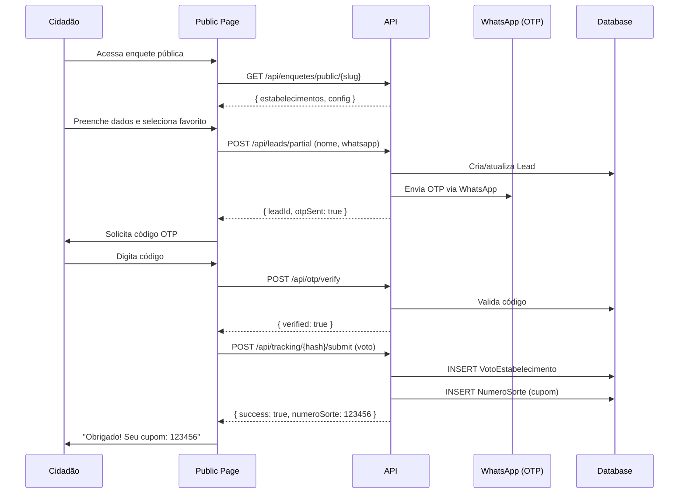

# Arquitetura Técnica - Prêmio Destaque

> **Spoke:** premio-destaque
> **Versão:** 2.0 (Rebranding GovTeam).0
> **Última atualização:** 2026-02-14

---

## 🎯 Visão Geral

O **Prêmio Destaque** é um spoke do ecossistema AIOS que permite organizações criarem campanhas de votação popular, premiações e sorteios, integrando com WhatsApp para engajamento de leads.

### Funcionalidades Principais

1. **Enquetes de Votação**
   - Pesquisas de satisfação
   - Votação popular (ex: Melhor Restaurante, Melhor Profissional)
   - Rankings em tempo real
   - Métricas e analytics

2. **Gestão de Estabelecimentos**
   - Cadastro de empresas/locais participantes
   - Segmentação hierárquica (Restaurantes → Pizzarias → Pizzaria X)
   - Upload de logos e fotos
   - Importação em massa (CSV/Excel)

3. **Leads e Contatos**
   - Captura de dados dos votantes
   - Verificação por OTP (WhatsApp/SMS)
   - Opt-in/Opt-out LGPD
   - Tags e segmentação
   - Cupons de sorteio automáticos

4. **Campanhas WhatsApp**
   - Integração com Evolution API
   - Disparo em massa
   - Status de envio (enviado, lido, respondido)
   - Webhooks para respostas

5. **Sorteios**
   - Geração automática de números da sorte
   - Sorteio aleatório de vencedores
   - Auditoria de sorteios
   - Exportação de ganhadores

6. **Tracking Links**
   - Links rastreáveis para compartilhamento
   - Analytics de cliques
   - Atribuição de votos por link

---

## 🔗 Integração com Hub

**OAuth2 SSO + HPAC** (padrão AIOS)

**6 Recursos HPAC:**

| Recurso | Ações | Descrição |
|---------|-------|-----------|
| `enquete` | list, create, read, update, delete, publish | Enquetes de votação |
| `campanha` | list, create, read, update, delete | Campanhas WhatsApp |
| `lead` | list, create, read, update, delete, export | Contatos capturados |
| `segmento` | list, create, read, update, delete | Categorias de estabelecimentos |
| `estabelecimento` | list, create, read, update, delete | Estabelecimentos participantes |
| `voto` | list, read, export | Votos registrados |

---

## 🏗️ Componentes Principais

### Módulos

#### 1. Enquetes

**Modelo:** `Enquete`

**Estados:**
- `RASCUNHO` - Em construção
- `PUBLICADA` - Ativa para votação
- `ENCERRADA` - Votação finalizada
- `ARQUIVADA` - Arquivada

**Features:**
- Votação única por CPF
- Votação ilimitada (com cupons)
- Limite de votos por lead
- Período de votação (início/fim)

#### 2. Estabelecimentos

**Modelo:** `Estabelecimento`

**Campos:**
- nome, logoUrl, descricao
- endereco, telefone, whatsapp
- website, instagram, facebook
- segmentos (M2M)

**Importação em massa:**
- CSV/Excel
- Validação de dados
- Preview antes de importar

#### 3. Leads

**Modelo:** `Lead`

**Verificação OTP:**
- Envio de código por WhatsApp
- Validação de código
- Expiração em 5 minutos

**LGPD:**
- Opt-out (cancelar recebimento)
- Consentimento registrado
- Campos opcionais

**Cupons:**
- Geração automática ao votar
- 1 cupom = 1 voto
- Usados em sorteios

#### 4. Campanhas WhatsApp

**Modelo:** `Campanha`

**Integração Evolution API:**
```typescript
{
  instance: "premio-instance",
  token: "evo-token",
  message: "Olá {{nome}}, participe da votação!",
  leads: [...],
  status: "AGENDADA"
}
```

**Estados:**
- `AGENDADA` - Aguardando envio
- `EM_ANDAMENTO` - Enviando
- `PAUSADA` - Pausada manualmente
- `CONCLUIDA` - Finalizada
- `CANCELADA` - Cancelada

#### 5. Sorteios

**Modelo:** `NumeroSorte`

**Geração:**
```typescript
// Ao votar, lead recebe 1 número da sorte
const numero = generateRandomNumber(100000, 999999);
await prisma.numeroSorte.create({
  data: {
    leadId,
    numero,
    enqueteId
  }
});
```

**Sorteio:**
```typescript
// Seleciona vencedores aleatoriamente
const vencedores = await sortearVencedores(enqueteId, quantidade);
```

---

## 🔄 Fluxos de Dados

### Fluxo: Votação



---

## 🛠️ Stack Tecnológico

**Backend:**
- Next.js 15, Prisma 5.22, PostgreSQL 14+
- OAuth2 via Hub (NextAuth.js)
- Evolution API (WhatsApp)
- AWS S3 (logos/fotos)

**Frontend:**
- React 19, TailwindCSS, shadcn/ui
- Recharts (analytics)
- React Hook Form + Zod

---

## 🔐 Segurança

**HPAC em todas APIs admin**

**Exemplo:**
```typescript
const hpac = await checkPermission(
  session.user.id,
  session.user.organizationId,
  'premio-destaque:enquete',
  'publish'
);
```

**LGPD:**
- Opt-out habilitado
- Dados sensíveis mascarados (HPAC field mask)
- Auditoria de acessos

---

## ⚡ Performance

**Caching:**
- Rankings cacheados (5 min)
- Resultados públicos (Redis)

**Indexing:**
```prisma
@@index([organizationId])
@@index([unitId])
@@index([organizationId, whatsapp])
@@unique([organizationId, cpf])
```

---

## 📚 Referências

- [API Reference](../api/API-REFERENCE.md)
- [Database Schema](../database/SCHEMA.md)
- [Hub Integration](../integration/PLATFORM-INTEGRATION.md)

---

**Documentação criada por:** @architect (Aria) - Fase 8
**Atualizado em:** 2026-02-14
