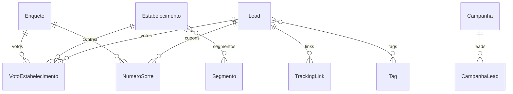

# Database Schema - Prêmio Destaque

> **Spoke:** premio-destaque
> **ORM:** Prisma 5.22
> **Database:** PostgreSQL 14+
> **Última atualização:** 2026-02-14

---

## 📊 Models (20+)

### CORE

**Segmento** - Categorias hierárquicas
**Estabelecimento** - Empresas/locais participantes
**EstabelecimentoSegmento** - Relacionamento M2M
**Lead** - Contatos capturados
**Tag** / **LeadTag** - Segmentação de leads

### ENQUETES

**Enquete** - Pesquisas/votações
**VotoEstabelecimento** - Votos registrados
**Resposta** - Respostas de formulários

### CAMPANHAS

**Campanha** - Campanhas WhatsApp
**CampanhaLead** - Leads da campanha
**TrackingLink** - Links rastreáveis

### SORTEIOS

**NumeroSorte** - Cupons de sorteio

### WHATSAPP

**WhatsAppInstance** - Instâncias Evolution API

---

## 🗺️ Diagrama ER Simplificado

---

## 📚 Referências

- [MODULE-ARCHITECTURE.md](../architecture/MODULE-ARCHITECTURE.md)
- [API-REFERENCE.md](../api/API-REFERENCE.md)

---

**Documentação criada por:** @architect (Aria) - Fase 8
**Atualizado em:** 2026-02-14
